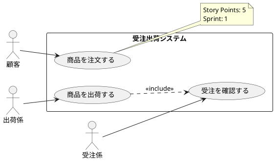

# Activity Diagram to Use Case Extractor v1

Extract use cases from activity diagrams by inferring domain models during analysis.

## Overview / 概要

This skill generates use cases and inferred domain models from activity diagrams WITHOUT requiring a pre-existing class diagram. The domain model is temporary and will be formalized later by usecase-to-class-v1.

**Primary Outputs:**
1. ⭐ **Markdown Use Case Specifications** (Cockburn format) - Individual .md files for each use case
2. PlantUML Use Case Diagram
3. Structured JSON (for code generation)
4. XMI Model (optional)

**Key differences from original:**
- ✅ Infers domain model from activity diagram
- ✅ Does not depend on class diagram
- ✅ **Generates individual Markdown files for ALL use cases**
- ✅ domain_model.source always set to "inferred"
- ✅ More suitable for iterative development
- ✅ **Multi-language support (Japanese/English/Bilingual)** ⭐ NEW!
- ✅ **Inherits language from activity diagram** ⭐ NEW!
- ✅ **japanese_name for all entities** ⭐ NEW!

---

## Language Support / 言語サポート ⭐

### Overview / 概要

This skill supports multi-language use case generation to accommodate international teams and Japanese domestic projects. Language settings are **inherited from the activity diagram** to ensure consistency across workflow steps.

**Supported Languages:**
- **Japanese (日本語)**: Full support for Japanese use case specifications
- **English**: Full support for English use case specifications  
- **Bilingual (バイリンガル)**: Dual-language output for international teams

### Language Inheritance

**Priority Order:**
1. **From activity-data.json** (highest priority)
   - Reads `language_config` section from activity diagram output
   - Ensures consistency with previous step
2. **Manual override** (if specified)
   - Can override inherited settings via `language` parameter
3. **Auto-detection** (fallback)
   - Analyzes activity diagram content if no configuration found

**Example inheritance:**
```json
// From scenario-to-activity-v1 output
{
  "language_config": {
    "detected_language": "ja",
    "entity_naming": "en",
    "japanese_names_included": true,
    "documentation_language": "ja"
  }
}

// activity-to-usecase-v1 uses these settings automatically
```

### Language Configuration

**Parameters:**
```python
language_options = {
    "language": "auto",              # auto | ja | en | bilingual
    "inherit_from_activity": True,   # Inherit from activity diagram (recommended)
    "entity_naming": "en",           # en | ja | bilingual (default: en)
    "include_japanese_name": True,   # Always include japanese_name attribute
    "usecase_spec_lang": "auto",     # auto | ja | en (for .md files)
    "diagram_lang": "auto",          # auto | ja | en (for PlantUML)
    "json_descriptions": "auto"      # auto | ja | en (for JSON descriptions)
}
```

### Output Language Control

**1. Use Case Markdown Files (UC-*.md):**
```markdown
# language="ja"
# Use Case UC-001: 商品を注文する

## ユースケース情報 / Use Case Information
- **ID**: UC-001
- **名前**: 商品を注文する
- **主アクター**: 顧客

## 主成功シナリオ / Main Success Scenario
1. 顧客が商品カタログを確認する
2. 顧客が注文したい商品を選択する

---

# language="en"
# Use Case UC-001: Place Order

## Use Case Information / ユースケース情報
- **ID**: UC-001
- **Name**: Place Order
- **Primary Actor**: Customer

## Main Success Scenario / 主成功シナリオ
1. Customer browses product catalog
2. Customer selects desired products

---

# language="bilingual"
# Use Case UC-001: 商品を注文する / Place Order

## ユースケース情報 / Use Case Information
- **ID**: UC-001
- **名前 / Name**: 商品を注文する / Place Order
- **主アクター / Primary Actor**: 顧客 / Customer

## 主成功シナリオ / Main Success Scenario
1. 顧客が商品カタログを確認する / Customer browses product catalog
2. 顧客が注文したい商品を選択する / Customer selects desired products
```

**2. PlantUML Use Case Diagram:**
```plantuml
' language="ja"
actor 顧客 as customer
usecase "UC-001\n商品を注文する" as UC001
customer --> UC001

' language="en"  
actor Customer as customer
usecase "UC-001\nPlace Order" as UC001
customer --> UC001

' language="bilingual"
actor "顧客 / Customer" as customer
usecase "UC-001\n商品を注文する\nPlace Order" as UC001
customer --> UC001
```

**3. JSON Output (usecase-output.json):**
```json
// language="ja"
{
  "usecases": [
    {
      "id": "UC-001",
      "name": "商品を注文する",
      "primary_actor": "顧客",
      "entities_referenced": [
        "Product",
        "Order", 
        "ReceivedOrder"
      ]
    }
  ],
  "domain_model": {
    "entities": [
      {
        "name": "Product",
        "japanese_name": "商品",
        "description": "販売する商品の情報"
      }
    ]
  }
}

// language="en"
{
  "usecases": [
    {
      "id": "UC-001",
      "name": "Place Order",
      "primary_actor": "Customer",
      "entities_referenced": [
        "Product",
        "Order",
        "ReceivedOrder"
      ]
    }
  ],
  "domain_model": {
    "entities": [
      {
        "name": "Product",
        "japanese_name": "Product",  // Same as name for English
        "description": "Information about products for sale"
      }
    ]
  }
}

// language="bilingual"
{
  "usecases": [
    {
      "id": "UC-001",
      "name": "商品を注文する / Place Order",
      "primary_actor": "顧客 / Customer",
      "entities_referenced": [
        "Product",
        "Order",
        "ReceivedOrder"
      ]
    }
  ],
  "domain_model": {
    "entities": [
      {
        "name": "Product",
        "japanese_name": "商品",
        "description": "販売する商品の情報 / Information about products for sale"
      }
    ]
  }
}
```

### Language Selection Guide

**Recommended settings:**
- **Domestic projects**: Inherit from activity diagram (typically `ja`)
- **International projects**: Inherit from activity diagram (typically `en`)
- **Mixed teams**: Inherit from activity diagram (typically `bilingual`)
- **Override needed**: Set `language` parameter explicitly

**Best practice:** Always use `inherit_from_activity=True` for consistency.

---

## Input / 入力

### Required Files

**Activity diagram:**
- `{project-name}_activity.puml` (if project name known)
- `activity_diagram.puml` (default)
- User-uploaded PDF/XMI/draw.io file

### Optional Context

**Original scenario information** (if available):
- Business overview
- Business rules
- Glossary
- Stakeholder information

This context improves domain model inference quality.

---

## Workflow / 処理フロー

### Step 0: Language Inheritance and Configuration ⭐ NEW!

**0a. Load activity diagram JSON:**
```python
activity_data = load_json(f"{project}_activity-data.json")
```

**0b. Extract language configuration:**
```python
if "language_config" in activity_data:
    inherited_config = activity_data["language_config"]
    language = inherited_config["detected_language"]
    entity_naming = inherited_config["entity_naming"]
    include_japanese = inherited_config["japanese_names_included"]
    doc_lang = inherited_config["documentation_language"]
else:
    # Fallback: auto-detect from activity diagram content
    language = auto_detect_language(activity_data)
    entity_naming = "en"
    include_japanese = True
    doc_lang = language
```

**0c. Apply language configuration:**
```python
lang_config = {
    "language": language,
    "entity_naming": entity_naming,
    "include_japanese_name": include_japanese,
    "usecase_spec_lang": doc_lang,
    "diagram_lang": doc_lang,
    "json_descriptions": doc_lang
}
```

**0d. Display language decision:**
```
━━━━━━━━━━━━━━━━━━━━━━━━━━━━━━━━━━
🌐 Language Configuration (Inherited)
━━━━━━━━━━━━━━━━━━━━━━━━━━━━━━━━━━
Source: activity_diagram
Language: Japanese (日本語)
Entity names: English
Japanese names: Included
Use case specs: Japanese
Diagram language: Japanese
━━━━━━━━━━━━━━━━━━━━━━━━━━━━━━━━━━
```

---

### Step 1: Parse Activity Diagram

**1a. Extract actors from swimlanes:**
```
Swimlanes:
|顧客| → Actor: 顧客
|受注係| → Actor: 受注係
|出荷係| → Actor: 出荷係
|システム| → Actor: システム (system)
```

**1b. Extract actions:**
- All activity nodes
- Decision points
- Flow transitions

**1c. Identify decision logic:**
- Conditional branches
- Business rules
- State transitions

---

### Step 2: Infer Temporary Domain Model

**CRITICAL:** This domain model is temporary and will be replaced by the formal model from usecase-to-class-v1.

**2a. Entity extraction:**

From activity annotations and action verbs:
```
Actions like "注文内容を登録する" → Entity: 受注
Actions like "在庫を確認する" → Entity: 在庫
Actions like "出荷する" → Entity: 出荷
Notes referencing entities → Extract entity names
```

**2a-1. Entity naming (NEW! ⭐):**

Apply language configuration to entity names:
```python
def generate_entity_name(japanese_term: str, lang_config: dict) -> dict:
    """
    Generate entity name based on language configuration.
    """
    # Always generate English name (for code compatibility)
    english_name = translate_to_english(japanese_term)  # e.g., "受注" → "ReceivedOrder"
    
    if lang_config["language"] == "ja":
        return {
            "name": english_name,
            "japanese_name": japanese_term,
            "description": f"{japanese_term}の情報"  # Japanese
        }
    elif lang_config["language"] == "en":
        return {
            "name": english_name,
            "japanese_name": english_name,  # Same as name
            "description": f"Information about {english_name.lower()}"  # English
        }
    else:  # bilingual
        return {
            "name": english_name,
            "japanese_name": japanese_term,
            "description": f"{japanese_term}の情報 / Information about {english_name.lower()}"
        }
```

**Example outputs:**
```json
// language="ja"
{
  "name": "ReceivedOrder",
  "japanese_name": "受注",
  "description": "受注の情報"
}

// language="en"
{
  "name": "ReceivedOrder",
  "japanese_name": "ReceivedOrder",
  "description": "Information about received order"
}

// language="bilingual"
{
  "name": "ReceivedOrder",
  "japanese_name": "受注",
  "description": "受注の情報 / Information about received order"
}
```

**2b. Attribute inference:**

Based on context and common patterns:
```
Entity: 受注
Inferred attributes:
- 受注ID (identifier)
- 受注日時 (timestamp)
- 顧客ID (foreign key)
- ステータス (state)
- 合計金額 (business data)
```

**2c. Relationship inference:**

From action flows:
```
"受注" contains "受注明細" (composition)
"商品" has "在庫" (association)
"受注" creates "出荷" (dependency)
```

**2d. Mark as inferred:**

```json
"domain_model": {
  "source": "inferred",
  "confidence": "medium",
  "note": "This model is inferred from activity diagram. Will be formalized in usecase-to-class-v1."
}
```

---

### Step 3: Group Actions into Use Cases

**3a. Identify IT system-supported actions:**

Filter out manual-only actions:
- ✓ "注文内容を登録する" (system supports)
- ✓ "在庫を確認する" (system function)
- ✗ "電話する" (manual only)
- ✗ "商品をピッキングする" (physical task)

**3b. Group related actions:**

Create cohesive use cases:
```
Use Case 1: "商品を注文する"
Actions:
- カタログ確認
- 注文登録
- 在庫確認
- 出荷依頼

Use Case 2: "商品を出荷する"
Actions:
- 出荷指示確認
- 出荷実行
- 在庫更新
```

**3c. Estimate story points:**

Based on complexity:
- Simple CRUD: 3 points
- With business logic: 5 points
- Complex workflow: 8 points
- Integration points: +2 points

---

### Step 4: Extract Use Case Details

For each use case:

**4a. Main flow:**
Extract sequential steps from activity diagram

**4b. Extensions:**
Extract alternative/error flows from decision branches

**4c. Preconditions:**
From scenario context or diagram start conditions

**4d. Success guarantee:**
From scenario context or diagram end states

**4e. Special requirements:**
From non-functional requirements (if provided in context)

---

### Step 5: Generate API Endpoint Suggestions

For each use case, suggest RESTful endpoints:

```
Use Case: "商品を注文する"
→ POST /api/orders (create order)
→ GET /api/inventory/:productId (check inventory)

Use Case: "商品を出荷する"
→ POST /api/shipments (create shipment)
→ PUT /api/inventory/:productId (update inventory)
```

---

### Step 6: Generate Markdown Use Case Specifications ⭐

**CRITICAL: Generate individual Markdown files for ALL use cases.**

**6a. Create usecase-specifications directory:**
```bash
mkdir -p {project}/usecase-specifications
```

**6b. For each use case, generate complete Markdown file:**

**Filename:** `usecase-specifications/UC-{ID}_{name}.md`

**Template:** Cockburn Use Case Format

**Sections to include:**
1. Use Case Overview (ID, name, actor, scope, level, story points, sprint, priority)
2. Stakeholders and Interests
3. Preconditions
4. Success Guarantee (Postconditions)
5. Main Success Scenario (numbered steps)
6. Extensions (alternative flows)
7. Special Requirements (performance, security, usability, reliability)
8. Technology and Data Variations
9. Frequency of Occurrence
10. Open Issues (if any)
11. Related Use Cases
12. Traceability (source activity diagram, related entities)
13. API Operations (REST endpoints)

**Example output:**
```
usecase-specifications/
  ├── UC-001_商品を注文する.md
  ├── UC-002_受注を確認する.md
  └── UC-003_商品を出荷する.md
```

---

### Step 7: Generate Additional Outputs

**7a. Generate PlantUML Use Case Diagram:**
`{project}_usecase-diagram.puml`

**7b. Generate Structured JSON Output:**
`{project}_usecase-output.json`

**7c. Generate XMI Model (if enabled):**
`{project}_usecase-model.xmi`

---

### Step 8: Generate Use Case Index (OPTIONAL)

**Filename:** `USECASE_INDEX.md`

Summary of all use cases with:
- Use case list with story points
- Sprint planning information
- API operations summary
- Usage guidelines

---

### Structured JSON Output Format

**Filename:** `{project}_usecase-output.json`

**Complete structure:**

```json
{
  "metadata": {
    "source": "{project}_activity.puml",
    "generated_at": "2026-01-24T...",
    "tool": "activity-to-usecase-v1",
    "version": "1.0",
    "domain_model_source": "inferred",
    "note": "Domain model is inferred. Will be formalized by usecase-to-class-v1."
  },
  "system": {
    "name": "システム名",
    "description": "業務概要"
  },
  "actors": [...],
  "usecases": [...],
  "domain_model": {
    "source": "inferred",
    "entities": [...],
    "note": "Inferred from activity diagram. Use usecase-to-class-v1 for formal model."
  },
  "technical_considerations": {...}
}
```

---

## Domain Model Inference Strategies / ドメインモデル推論戦略

### Strategy 1: From Entity Annotations

If activity diagram has notes referencing entities:
```
note right
  受注.登録する()
  在庫.確認する()
end note
```
→ Extract: 受注, 在庫 entities

### Strategy 2: From Action Verbs

Pattern matching on actions:
```
"XXXを登録する" → Entity: XXX
"XXXを確認する" → Entity: XXX
"XXXを更新する" → Entity: XXX
```

### Strategy 3: From Business Domain Knowledge

Common entity patterns:
- Order domain: Order, OrderItem, Product, Customer
- Inventory domain: Inventory, Product, Warehouse
- Shipping domain: Shipment, Delivery, Carrier

### Strategy 4: From Glossary (if provided)

Use provided terminology:
```
用語集:
- 受注: 顧客からの注文
→ Entity: 受注 (Order)
```

---

## Attribute Inference Patterns / 属性推論パターン

### Standard Attributes

All entities get:
```
- ID: string (UUID)
- createdAt: DateTime
- updatedAt: DateTime
```

### Entity-Specific Patterns

**Order entity:**
```
- orderDate: DateTime
- customerId: string
- status: enum
- totalAmount: number
```

**Inventory entity:**
```
- productId: string
- quantity: number
- lastUpdatedAt: DateTime
```

**Shipment entity:**
```
- orderId: string
- shipmentDate: DateTime
- status: string
```

---

## Output / 出力

**CRITICAL: All use cases MUST be output as individual Markdown files in Cockburn format.**

### Output Priority

1. **Use Case Specifications (Markdown)** - REQUIRED ⭐
2. PlantUML Use Case Diagram - REQUIRED
3. Structured JSON Output - REQUIRED
4. XMI Model - OPTIONAL (controlled by execution options)

---

### 1. Use Case Specifications (Markdown) - REQUIRED ⭐

**CRITICAL: This is the PRIMARY output format for use cases.**

**Directory:** `usecase-specifications/`  
**Files:** `UC-{ID}_{name}.md` (one file per use case)

**ALL use cases MUST be generated as individual Markdown files in Cockburn format.**

Detailed use case descriptions following Alistair Cockburn's template.

**Example:** `usecase-specifications/UC-001_商品を注文する.md`

```markdown
# UC-001: 商品を注文する

## ユースケース情報 / Use Case Information
- **ID**: UC-001
- **名前**: 商品を注文する
- **スコープ**: 受注出荷システム
- **レベル**: ユーザーゴール
- **主アクター**: 顧客
- **ストーリーポイント**: 5
- **スプリント**: 1

## ステークホルダーと関心事 / Stakeholders and Interests
- **顧客**: スムーズに注文を完了したい
- **受注係**: 正確な注文情報を受け取りたい
- **会社**: 在庫を適切に管理したい
- **出荷係**: 明確な出荷指示を受け取りたい

## 事前条件 / Preconditions
- 顧客が商品カタログにアクセスできる
- システムが稼働している
- 受注係がログインしている

## 成功保証（事後条件）/ Success Guarantee (Postconditions)
- 注文が正しく登録されている
- 在庫が適切に引き当てられている
- 出荷指示が作成されている
- 顧客に受注確認が通知されている

## 主成功シナリオ / Main Success Scenario

1. 顧客が商品カタログを確認する
2. 顧客が注文したい商品を選択する
3. 顧客が電話で注文内容を伝える
4. 受注係が注文内容をシステムに登録する
5. システムが商品の在庫を確認する
6. システムが在庫を引き当てる
7. 受注係が出荷を依頼する
8. システムが出荷指示を作成する
9. システムが顧客に受注確認を送信する

## 拡張（代替フロー）/ Extensions (Alternative Flows)

**5a. 在庫不足の場合:**
- 5a1. システムが在庫不足を通知する
- 5a2. 受注係が顧客に在庫状況を説明する
- 5a3. 顧客が注文内容を変更するか、キャンセルする
- 5a4a. 変更の場合: ステップ4に戻る
- 5a4b. キャンセルの場合: ユースケース終了

**4a. 新規顧客の場合:**
- 4a1. 受注係が顧客情報を登録する
- 4a2. ステップ4に戻る

***a. いつでも: システムエラー:**
- *a1. システムがエラーメッセージを表示する
- *a2. 受注係がシステム管理者に連絡する
- *a3. エラー解決後、中断したステップから再開

## 特別要件 / Special Requirements

**性能要件:**
- 在庫確認の応答時間: 1秒以内
- 注文登録の完了時間: 3秒以内

**セキュリティ要件:**
- 顧客情報は暗号化して保存
- 受注係の認証必須

**ユーザビリティ要件:**
- 注文入力画面は3ステップ以内で完了
- エラーメッセージは明確で具体的

**信頼性要件:**
- システム稼働率: 99.9%以上
- データバックアップ: 1日1回

## 技術とデータのバリエーション / Technology and Data Variations

**データフォーマット:**
- 日付形式: YYYY-MM-DD
- 金額: 小数点以下2桁

**通信プロトコル:**
- REST API (JSON)
- WebSocket (リアルタイム通知)

## 発生頻度 / Frequency
- 1日あたり平均: 50件
- ピーク時: 100件/日

## 未解決事項 / Open Issues
- キャンセル処理の詳細フロー
- 返品処理との連携
- 複数配送先への対応

## 関連ユースケース / Related Use Cases
- UC-002: 受注を確認する (included)
- UC-004: 注文をキャンセルする (related)

## トレーサビリティ
- **派生元アクティビティ図**: {project}_activity.puml
- **関連エンティティ**: 受注, 受注明細, 商品, 在庫, 顧客

---
*生成日時: {timestamp}*
*生成ツール: activity-to-usecase-v1*
```

**All use cases follow this format:**
- Complete Cockburn template
- Detailed main flow and extensions
- Special requirements
- Traceability information

**File organization:**
```
{project}/
  └── usecase-specifications/
      ├── UC-001_{name}.md
      ├── UC-002_{name}.md
      └── UC-003_{name}.md
```

---

### 2. PlantUML Use Case Diagram - REQUIRED

**Filename:** `{project}_usecase-diagram.puml`

Complete use case diagram showing actors, use cases, and relationships.

**Contents:**


**Features:**
- All actors with clear naming
- All use cases sized for sprints
- Relationships (include, extend, generalization)
- Story points annotations
- System boundary

---

### 3. Structured JSON Output - REQUIRED

**Filename:** `{project-name}_usecase-output.json`

Machine-readable use case definitions (for downstream code generation).

**Key sections:**
- metadata (with domain_model_source: "inferred")
- actors
- usecases (with story points)
- domain_model (inferred entities)
- technical_considerations

---

### 4. XMI Model - OPTIONAL

**Filename:** `{project}_usecase-model.xmi`

**Generation controlled by execution options.**

UML 2.5.1 Use Case Model in standard XMI 2.5.1 format.

**Contents:**
- All actors
- All use cases
- Relationships (associations, include, extend)
- Use case specifications (as notes)
- System boundary

**Compliance:**
- UML 2.5.1 specification (OMG)
- XMI 2.5.1 format
- Eclipse Modeling Framework compatible

**XMI Structure:**
```xml
<?xml version="1.0" encoding="UTF-8"?>
<xmi:XMI xmi:version="2.5.1" 
         xmlns:xmi="http://www.omg.org/spec/XMI/20131001"
         xmlns:uml="http://www.omg.org/spec/UML/20161101">
  <uml:Model xmi:type="uml:Model" name="{project}">
    <packagedElement xmi:type="uml:Package" name="UseCaseModel">
      <!-- Actors -->
      <packagedElement xmi:type="uml:Actor" name="顧客"/>
      <packagedElement xmi:type="uml:Actor" name="受注係"/>
      
      <!-- Use Cases -->
      <packagedElement xmi:type="uml:UseCase" name="商品を注文する">
        <ownedComment xmi:type="uml:Comment" body="[Full specification]"/>
      </packagedElement>
      
      <!-- Associations -->
      <packagedElement xmi:type="uml:Association">
        <memberEnd xmi:idref="actor_customer"/>
        <memberEnd xmi:idref="usecase_UC001"/>
      </packagedElement>
    </packagedElement>
  </uml:Model>
</xmi:XMI>
```

**Purpose:**
- Tool interoperability
- Model-driven engineering
- Formal specification exchange
- Integration with UML tools

---

### 5. Summary Display (Console Output)

Show to user:
```
=== activity-to-usecase-v1 完了 ===

✅ Generated Files:
1. {project}_usecase-diagram.puml (PlantUML)
2. UC-001_商品を注文する.md (Markdown)
3. UC-002_商品を出荷する.md (Markdown)
4. {project}_usecase-output.json (JSON)
5. {project}_usecase-model.xmi (XMI)

=== Use Case Summary ===

Use Cases Generated: 2
Total Story Points: 10
Sprint Distribution:
- Sprint 1: 10 points (2 use cases)

⚠️ Domain Model Status: INFERRED
The domain model was inferred from the activity diagram.
For production quality, proceed to usecase-to-class-v1 to create formal class diagram.

Inferred Entities: 5
- 受注 (Order)
- 受注明細 (OrderItem)
- 商品 (Product)
- 在庫 (Inventory)
- 出荷 (Shipment)

Next Step: Run usecase-to-class-v1 to formalize domain model
```

---

## Quality Indicators / 品質指標

### Inference Confidence Levels

**High confidence:**
- Entities explicitly mentioned in notes
- Clear action-entity patterns
- Glossary provided

**Medium confidence:**
- Entities inferred from action verbs
- Standard domain patterns applied
- Some context available

**Low confidence:**
- Minimal annotations
- Generic action names
- No supporting context

Mark confidence in JSON:
```json
"domain_model": {
  "source": "inferred",
  "confidence": "medium"
}
```

---

## Integration with Workflow / ワークフロー連携

**Position in uml-workflow-v1:**

```
Step 1: scenario-to-activity-v1
  ↓ Activity diagram
Step 2: activity-to-usecase-v1 ← YOU ARE HERE
  ↓ Use cases + inferred domain model
Step 3: usecase-to-class-v1
  ↓ Formal class diagram
Step 4: usecase-to-code-v1
```

**What happens next:**
- usecase-to-class-v1 will create formal class diagram
- Inferred domain model will be replaced
- Code generation will use formal model

---

## Comparison with Original Version / 旧バージョンとの比較

| Feature | Original | v1 |
|---------|----------|-----|
| Class diagram dependency | Required | Not required |
| Domain model source | class_diagram | inferred |
| Domain model quality | High | Medium |
| Suitable for | Final implementation | Iterative development |
| Workflow position | Step 3 of 4 | Step 2 of 4 |

---

## Best Practices / ベストプラクティス

### For Users

1. **Proceed to usecase-to-class-v1**: Don't stop here for production
2. **Review inferred entities**: Check if major entities captured
3. **Provide context**: Original scenario helps inference
4. **Accept iteration**: This is a refinement step

### For Quality

1. **Rich activity diagrams**: More annotations = better inference
2. **Clear action names**: Use domain terminology
3. **Entity notes**: Reference entities in activity notes
4. **Context matters**: Provide original scenario when possible

---

## Limitations / 制限事項

**Inferred domain model is NOT production-ready:**
- ❌ May miss important attributes
- ❌ Relationships may be incomplete
- ❌ Types may be generic
- ✅ Good enough for use case definition
- ✅ Will be replaced by formal model

**Always proceed to usecase-to-class-v1 for production systems.**

---

## Example Output Structure / 出力構造例

```json
{
  "metadata": {
    "domain_model_source": "inferred"
  },
  "domain_model": {
    "source": "inferred",
    "confidence": "medium",
    "entities": [
      {
        "name": "受注",
        "attributes": [
          {"name": "受注ID", "type": "string"},
          {"name": "受注日時", "type": "date"},
          {"name": "ステータス", "type": "enum"}
        ],
        "relationships": [
          {"type": "has-many", "target": "受注明細"}
        ]
      }
    ]
  }
}
```

---

## Version History / バージョン履歴

- **v1.0** (2026-01-22): Initial version
  - Independent domain model inference
  - No class diagram dependency
  - Always marks as "inferred"
  - Designed for iterative workflow
