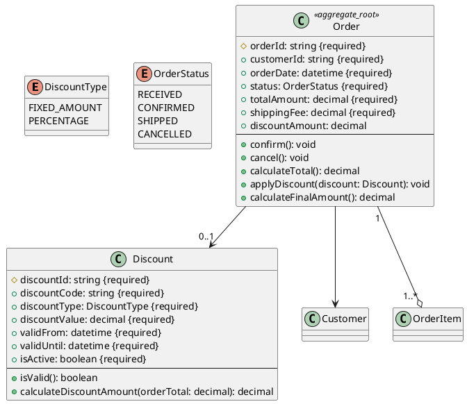

# モデル修正の実践例

## シナリオ / Scenario

受注管理システムのレビュー後、以下の修正が必要になった:

1. **配送料フィールドの追加**: Orderエンティティに配送料を追加
2. **割引機能の追加**: 新しいDiscountエンティティを追加
3. **多重度の修正**: OrderとOrderItemのリレーション多重度を修正
4. **ビジネスメソッド追加**: 割引適用メソッドを追加

---

## 修正前のdomain-model.json（抜粋）/ Before Modification (excerpt)

```json
{
  "metadata": {
    "source": "usecase-to-class-v1",
    "generated_at": "2026-01-24T10:00:00Z",
    "version": "1.0",
    "status": "formal"
  },
  "entities": [
    {
      "name": "Order",
      "japanese_name": "受注",
      "description": "顧客からの注文",
      "stereotype": "aggregate_root",
      "attributes": [
        {
          "name": "orderId",
          "type": "string",
          "primary_key": true,
          "required": true,
          "description": "受注ID"
        },
        {
          "name": "customerId",
          "type": "string",
          "required": true,
          "description": "顧客ID"
        },
        {
          "name": "orderDate",
          "type": "datetime",
          "required": true,
          "description": "受注日時"
        },
        {
          "name": "status",
          "type": "OrderStatus",
          "required": true,
          "default": "RECEIVED",
          "description": "受注ステータス"
        },
        {
          "name": "totalAmount",
          "type": "decimal",
          "required": true,
          "description": "合計金額"
        }
      ],
      "relationships": [
        {
          "type": "belongs-to",
          "target": "Customer",
          "source_multiplicity": "0..*",
          "target_multiplicity": "1",
          "description": "注文は1人の顧客に属する"
        },
        {
          "type": "has-many",
          "target": "OrderItem",
          "source_multiplicity": "1",
          "target_multiplicity": "*",
          "description": "注文は複数の明細を持つ"
        }
      ],
      "business_methods": [
        {
          "name": "confirm",
          "description": "受注を確定する",
          "parameters": [],
          "return_type": "void"
        },
        {
          "name": "cancel",
          "description": "受注をキャンセルする",
          "parameters": [],
          "return_type": "void"
        },
        {
          "name": "calculateTotal",
          "description": "合計金額を計算する",
          "parameters": [],
          "return_type": "decimal"
        }
      ]
    }
  ],
  "enumerations": [
    {
      "name": "OrderStatus",
      "description": "受注ステータス",
      "values": [
        {"name": "RECEIVED", "description": "受付済み"},
        {"name": "CONFIRMED", "description": "確定済み"},
        {"name": "SHIPPED", "description": "出荷済み"},
        {"name": "CANCELLED", "description": "キャンセル済み"}
      ]
    }
  ]
}
```

---

## 修正後のdomain-model.json / After Modification

```json
{
  "metadata": {
    "source": "manual-edit",
    "generated_at": "2026-01-24T10:00:00Z",
    "version": "1.1",  // バージョン更新
    "status": "formal",
    "last_modified_by": "レビューチーム",
    "modification_note": "配送料、割引機能追加"
  },
  "entities": [
    {
      "name": "Order",
      "japanese_name": "受注",
      "description": "顧客からの注文",
      "stereotype": "aggregate_root",
      "attributes": [
        {
          "name": "orderId",
          "type": "string",
          "primary_key": true,
          "required": true,
          "description": "受注ID"
        },
        {
          "name": "customerId",
          "type": "string",
          "required": true,
          "description": "顧客ID"
        },
        {
          "name": "orderDate",
          "type": "datetime",
          "required": true,
          "description": "受注日時"
        },
        {
          "name": "status",
          "type": "OrderStatus",
          "required": true,
          "default": "RECEIVED",
          "description": "受注ステータス"
        },
        {
          "name": "totalAmount",
          "type": "decimal",
          "required": true,
          "description": "合計金額"
        },
        // ★★★ 追加1: 配送料フィールド ★★★
        {
          "name": "shippingFee",
          "type": "decimal",
          "required": true,
          "default": "0.00",
          "description": "配送料",
          "validation": {
            "min": 0,
            "max": 10000
          }
        },
        // ★★★ 追加2: 割引額フィールド ★★★
        {
          "name": "discountAmount",
          "type": "decimal",
          "required": false,
          "default": "0.00",
          "description": "割引額"
        }
      ],
      "relationships": [
        {
          "type": "belongs-to",
          "target": "Customer",
          "source_multiplicity": "0..*",
          "target_multiplicity": "1",
          "description": "注文は1人の顧客に属する"
        },
        {
          "type": "has-many",
          "target": "OrderItem",
          "source_multiplicity": "1",
          "target_multiplicity": "1..*",  // ★★★ 修正: 最低1個必要 ★★★
          "description": "注文は最低1つの明細を持つ"
        },
        // ★★★ 追加3: Discountとのリレーション ★★★
        {
          "type": "has-one",
          "target": "Discount",
          "source_multiplicity": "0..*",
          "target_multiplicity": "0..1",
          "description": "注文は0または1つの割引を持つ"
        }
      ],
      "business_methods": [
        {
          "name": "confirm",
          "description": "受注を確定する",
          "parameters": [],
          "return_type": "void"
        },
        {
          "name": "cancel",
          "description": "受注をキャンセルする",
          "parameters": [],
          "return_type": "void"
        },
        {
          "name": "calculateTotal",
          "description": "合計金額を計算する",
          "parameters": [],
          "return_type": "decimal"
        },
        // ★★★ 追加4: 割引適用メソッド ★★★
        {
          "name": "applyDiscount",
          "description": "割引を適用する",
          "parameters": [
            {
              "name": "discount",
              "type": "Discount",
              "required": true
            }
          ],
          "return_type": "void",
          "side_effects": [
            "discountAmountを更新",
            "totalAmountを再計算"
          ]
        },
        // ★★★ 追加5: 最終金額計算メソッド ★★★
        {
          "name": "calculateFinalAmount",
          "description": "割引と配送料を含む最終金額を計算",
          "parameters": [],
          "return_type": "decimal"
        }
      ],
      // ★★★ 追加6: ビジネス不変条件 ★★★
      "invariants": [
        {
          "description": "最終金額は0以上",
          "rule": "totalAmount - discountAmount + shippingFee >= 0"
        },
        {
          "description": "割引額は合計金額を超えない",
          "rule": "discountAmount <= totalAmount"
        }
      ]
    },
    // ★★★ 追加7: 新しいDiscountエンティティ ★★★
    {
      "name": "Discount",
      "japanese_name": "割引",
      "description": "注文に適用される割引",
      "stereotype": "entity",
      "attributes": [
        {
          "name": "discountId",
          "type": "string",
          "primary_key": true,
          "required": true,
          "description": "割引ID"
        },
        {
          "name": "discountCode",
          "type": "string",
          "required": true,
          "unique": true,
          "description": "割引コード"
        },
        {
          "name": "discountType",
          "type": "DiscountType",
          "required": true,
          "description": "割引タイプ（固定額/割合）"
        },
        {
          "name": "discountValue",
          "type": "decimal",
          "required": true,
          "description": "割引値（金額または割合）",
          "validation": {
            "min": 0
          }
        },
        {
          "name": "validFrom",
          "type": "datetime",
          "required": true,
          "description": "有効開始日時"
        },
        {
          "name": "validUntil",
          "type": "datetime",
          "required": true,
          "description": "有効終了日時"
        },
        {
          "name": "isActive",
          "type": "boolean",
          "required": true,
          "default": "true",
          "description": "有効フラグ"
        }
      ],
      "relationships": [
        {
          "type": "has-many",
          "target": "Order",
          "source_multiplicity": "0..1",
          "target_multiplicity": "0..*",
          "description": "割引は複数の注文に適用可能"
        }
      ],
      "business_methods": [
        {
          "name": "isValid",
          "description": "割引が有効かチェック",
          "parameters": [],
          "return_type": "boolean"
        },
        {
          "name": "calculateDiscountAmount",
          "description": "割引額を計算",
          "parameters": [
            {
              "name": "orderTotal",
              "type": "decimal",
              "required": true
            }
          ],
          "return_type": "decimal"
        }
      ]
    }
  ],
  "enumerations": [
    {
      "name": "OrderStatus",
      "description": "受注ステータス",
      "values": [
        {"name": "RECEIVED", "description": "受付済み"},
        {"name": "CONFIRMED", "description": "確定済み"},
        {"name": "SHIPPED", "description": "出荷済み"},
        {"name": "CANCELLED", "description": "キャンセル済み"}
      ]
    },
    // ★★★ 追加8: 新しい列挙型 ★★★
    {
      "name": "DiscountType",
      "description": "割引タイプ",
      "values": [
        {"name": "FIXED_AMOUNT", "value": "fixed", "description": "固定額割引"},
        {"name": "PERCENTAGE", "value": "percentage", "description": "割合割引"}
      ]
    }
  ]
}
```

---

## 修正のサマリー / Modification Summary

### 追加された機能

1. ✅ **配送料**: `Order.shippingFee`
2. ✅ **割引額**: `Order.discountAmount`
3. ✅ **割引エンティティ**: `Discount`
4. ✅ **割引タイプ列挙型**: `DiscountType`
5. ✅ **ビジネスメソッド**: `applyDiscount()`, `calculateFinalAmount()`
6. ✅ **ビジネス不変条件**: 金額の整合性ルール

### 修正された内容

1. ✅ **多重度**: OrderItem を最低1個必須に変更
2. ✅ **バージョン**: 1.0 → 1.1
3. ✅ **メタデータ**: 修正者と修正理由を記録

---

## json-to-modelsの実行 / Running json-to-models

```
Claude: json-to-modelsを使って、
この修正されたdomain-model.jsonから
すべてのモデルを再生成してください
```

### 生成される成果物

1. **PlantUML (`order-system_class.puml`)**


2. **XMI (`order-system_class-model.xmi`)**
   - UML 2.5.1準拠
   - Discountクラスを含む完全なモデル

3. **Architecture Overview (`order-system_architecture-overview.md`)**
   - 割引機能の説明を含む
   - 更新されたビジネスルール

---

## 次のステップ: コード再生成 / Next Step: Code Regeneration

```
Claude: usecase-to-code-v1を使って、
この更新されたドメインモデルで
TypeScriptアプリケーションを再生成してください
```

### 生成されるコードの変更

**Backend:**
```typescript
// domain/Order.ts
export class Order {
  // 新しいフィールド
  private shippingFee: Decimal;
  private discountAmount: Decimal;
  
  // 新しいメソッド
  applyDiscount(discount: Discount): void {
    this.discountAmount = discount.calculateDiscountAmount(this.totalAmount);
    this.totalAmount = this.calculateFinalAmount();
  }
  
  calculateFinalAmount(): Decimal {
    return this.totalAmount
      .minus(this.discountAmount)
      .plus(this.shippingFee);
  }
}

// domain/Discount.ts (新規)
export class Discount {
  // ... 完全な実装
}
```

**Database Schema:**
```prisma
model Order {
  orderId        String   @id
  customerId     String
  orderDate      DateTime
  status         OrderStatus
  totalAmount    Decimal  @db.Decimal(10, 2)
  shippingFee    Decimal  @db.Decimal(10, 2) @default(0.00)  // 追加
  discountAmount Decimal? @db.Decimal(10, 2) @default(0.00)  // 追加
  
  customer       Customer @relation(...)
  items          OrderItem[]
  discount       Discount? @relation(...)  // 追加
}

model Discount {  // 新規
  discountId    String   @id
  discountCode  String   @unique
  discountType  DiscountType
  discountValue Decimal  @db.Decimal(10, 2)
  validFrom     DateTime
  validUntil    DateTime
  isActive      Boolean  @default(true)
  
  orders        Order[]
}
```

**Frontend:**
```tsx
// components/OrderForm.tsx
<div>
  {/* 新しいフィールド */}
  <label>配送料</label>
  <input
    type="number"
    value={order.shippingFee}
    onChange={...}
  />
  
  <label>割引コード</label>
  <input
    type="text"
    placeholder="割引コードを入力"
    onChange={handleDiscountCode}
  />
  
  {/* 最終金額表示 */}
  <div>
    <strong>最終金額:</strong>
    {calculateFinalAmount()}
  </div>
</div>
```

---

## まとめ / Summary

この例では、以下の修正ワークフローを実践しました:

```
1. 初回生成
   uml-workflow-v1
   ↓
2. レビュー
   → 配送料と割引機能が必要と判明
   ↓
3. JSON編集
   domain-model.json を修正
   - 属性追加
   - エンティティ追加
   - リレーション追加
   - ビジネスメソッド追加
   ↓
4. モデル再生成
   json-to-models
   → PlantUML、XMI、Markdown更新
   ↓
5. コード再生成
   usecase-to-code-v1
   → TypeScript/Prisma/Reactすべて更新
```

**結果:**
- ✅ 配送料計算機能
- ✅ 割引適用機能
- ✅ データベーススキーマ更新
- ✅ フロントエンドUI更新
- ✅ ビジネスロジック実装

すべてdomain-model.jsonの修正から自動生成されました！
