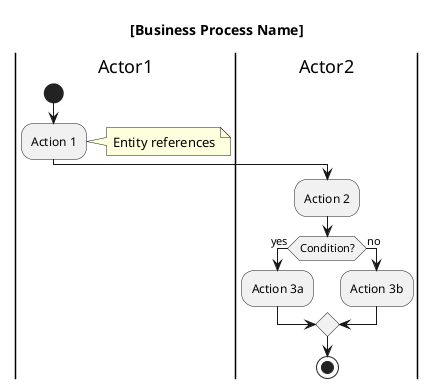

# Scenario to Activity Diagram v1

Transform comprehensive business scenarios into UML activity diagrams with internally-managed temporary domain models.

## Overview

This skill generates activity diagrams by analyzing business scenarios and creating a temporary domain model during the process. Unlike the original version, it does NOT require a pre-existing class diagram, making it more flexible for early-stage analysis.

**Key differences from original:**
- ✅ Creates temporary domain model internally
- ✅ Does not depend on class diagram
- ✅ Supports rich scenario input format
- ✅ Suitable for iterative development
- ✅ **Multi-language support (Japanese/English/Bilingual)** ⭐ NEW!
- ✅ **Auto-detects input language** ⭐ NEW!

---

## Language Support ⭐ NEW!

### Overview

This skill supports multi-language input and output to accommodate international teams and Japanese domestic projects.

**Supported Languages:**
- **Japanese (日本語)**: Full support for Japanese business scenarios and documentation
- **English**: Full support for English business scenarios and documentation
- **Bilingual (バイリンガル)**: Dual-language output for international teams

### Language Detection

**Automatic Detection (Default):**
- Analyzes business overview and scenario text
- Detects dominant language (>70% of content)
- Applies detected language to all outputs

**Manual Override:**
- Can be explicitly specified via `language` parameter
- Useful when input is mixed or minimal

### Language Configuration

**Parameters:**
```python
language_options = {
    "language": "auto",              # auto | ja | en | bilingual
    "entity_naming": "en",           # en | ja | bilingual (default: en)
    "include_japanese_name": True,   # Always include japanese_name attribute
    "documentation_lang": "auto",    # auto | ja | en (follows language)
    "diagram_comments": "auto",      # auto | ja | en (follows language)
    "inherit_from_workflow": True    # Inherit from uml-workflow-v3
}
```

**When inherited from workflow:**
- `inherit_from_workflow=True`: Use language setting from uml-workflow-v3
- Ensures consistency across all workflow steps

### Output Language Control

**1. Entity Names (Temporary Domain Model):**
```json
// language="ja" or "auto" (Japanese detected)
{
  "name": "ReceivedOrder",        // Always English for code compatibility
  "japanese_name": "受注",        // Japanese name included
  "description": "システムに登録された受注情報"  // Japanese
}

// language="en"
{
  "name": "ReceivedOrder",
  "japanese_name": "ReceivedOrder",  // Same as name
  "description": "Order registered in the system"  // English
}

// language="bilingual"
{
  "name": "ReceivedOrder",
  "japanese_name": "受注",
  "description": "受注 / Order registered in the system"  // Both
}
```

**2. PlantUML Activity Diagram:**
```plantuml
' language="ja"
|顧客|
:商品カタログを確認して選択する;
note right
  エンティティ: 商品
  ビジネスルール: 在庫あり確認
end note

' language="en"
|Customer|
:Browse and select product catalog;
note right
  Entity: Product
  Business rule: Check inventory availability
end note

' language="bilingual"
|顧客 / Customer|
:商品カタログを確認して選択する / Browse and select product catalog;
note right
  エンティティ / Entity: Product (商品)
  ビジネスルール / Business rule: 在庫あり確認 / Check inventory availability
end note
```

**3. Business Scenario Document:**
- Markdown file follows `documentation_lang` setting
- Headers, descriptions, and explanations in selected language
- Technical terms can be bilingual

### Language Selection Guide

**When to use each mode:**

| Mode | Use Case | Output Example |
|------|----------|----------------|
| **auto** | Input language clear | Japanese input → Japanese output |
| **ja** | Japanese-only team | すべて日本語 |
| **en** | International team | All English |
| **bilingual** | Mixed team, handover | 日本語 / English |

**Recommended:**
- **Domestic projects**: `language="ja"`
- **International projects**: `language="en"`
- **Offshore handover**: `language="bilingual"`
- **Unknown context**: `language="auto"` (safest)

---

## Input Format

### Required Information

#### 1. Business Overview (必須)
High-level description of the business domain and system purpose.

**Example:**
```
業務概要:
B2B卸売業向けの受注管理・在庫確認・出荷管理を統合したシステム。
小売業者からの電話注文を受け付け、在庫確認後に出荷手配を行う。
```

#### 2. Business Scenario (必須)
Detailed step-by-step description of the business process.

**Example:**
```
業務シナリオ:
1. 顧客が商品カタログを確認する
2. 顧客が電話で注文内容を伝える
3. 受注係が注文内容を登録する
4. システムが在庫を確認する
5a. [在庫あり] 受注係が出荷を依頼する
5b. [在庫なし] 顧客が注文内容を変更する
6. 出荷係が出荷指示書を確認する
7. 出荷係が商品を出荷する
8. システムが在庫量を更新する
```

### Optional Information

#### 3. Business Rules (オプション)
Constraints, validations, and business logic.

**Example:**
```
ビジネスルール:
- 営業時間: 平日9:00-18:00のみ受注可能
- 最小注文金額: 10,000円以上
- 在庫引当: 注文確定時に自動引当
- キャンセル: 出荷前のみ可能
```

#### 4. Glossary (オプション)
Domain-specific terminology definitions.

**Example:**
```
用語集:
- 受注: 顧客からの注文を受け付けること
- 出荷指示書: 出荷作業の指示を記載した文書
- 在庫引当: 注文に対して在庫を予約確保すること
```

#### 5. Stakeholder Information (オプション)
Actor and role definitions.

**Example:**
```
ステークホルダー情報:
- 顧客: 商品を注文する小売業者
- 受注係: 注文を受け付けるスタッフ
- 出荷係: 商品の出荷を担当するスタッフ
- システム: 受注出荷システム本体
```

#### 6. Non-Functional Requirements (オプション)
Performance, security, and other quality attributes.

**Example:**
```
非機能要件:
- 在庫確認: 1秒以内に応答
- 同時アクセス: 50ユーザーまで対応
- データ保持: 過去3年分の受注履歴
```

---

## Workflow

### Step 0: Language Detection and Configuration ⭐ NEW!

**0a. Check for language parameter:**
```python
if language_options.inherit_from_workflow and workflow_language is not None:
    language = workflow_language
elif language_options.language != "auto":
    language = language_options.language
else:
    # Auto-detect from input
    language = detect_language(business_overview, business_scenario)
```

**0b. Language detection logic:**
```python
def detect_language(overview: str, scenario: str) -> str:
    """
    Detect language from input text.
    Returns: "ja" | "en"
    """
    combined_text = overview + " " + scenario
    
    # Count Japanese characters (Hiragana, Katakana, Kanji)
    japanese_chars = count_japanese_characters(combined_text)
    total_chars = len(combined_text.replace(" ", ""))
    
    if total_chars == 0:
        return "en"  # Default to English if no content
    
    japanese_ratio = japanese_chars / total_chars
    
    if japanese_ratio > 0.3:  # >30% Japanese
        return "ja"
    else:
        return "en"
```

**0c. Set language configuration:**
```python
lang_config = {
    "language": language,                    # Detected or specified
    "entity_naming": "en",                   # Always English
    "japanese_name": True,                   # Always include
    "documentation": language,               # Follow language
    "diagram_comments": language,            # Follow language
    "bilingual": (language == "bilingual")   # Bilingual mode flag
}
```

**0d. Display language decision:**
```
━━━━━━━━━━━━━━━━━━━━━━━━━━━━━━━━━━
🌐 Language Configuration
━━━━━━━━━━━━━━━━━━━━━━━━━━━━━━━━━━
Detected/Selected: Japanese (日本語)
Entity names: English
Japanese names: Included
Documentation: Japanese
Diagram comments: Japanese
━━━━━━━━━━━━━━━━━━━━━━━━━━━━━━━━━━
```

---

### Step 1: Analyze Input and Create Temporary Domain Model

Parse the provided scenario and create an internal temporary domain model:

**1a. Extract Actors/Roles:**
- From stakeholder information (if provided)
- From scenario description (who performs actions)
- From business overview

**1b. Identify Entities:**
- Nouns in scenario (Order, Product, Inventory)
- Terms in glossary (if provided)
- Objects being manipulated

**1c. Identify Actions:**
- Verbs in scenario (register, confirm, ship)
- State changes
- Decision points

**1d. Extract Business Rules:**
- Conditions and constraints
- Validation rules
- State transition rules

**Output (Internal):**
```
Temporary Domain Model:
Actors: [顧客, 受注係, 出荷係, システム]
Entities: [受注, 商品, 在庫, 出荷, 出荷指示書]
Actions: [登録する, 確認する, 出荷する, 更新する]
Rules: [在庫あり/なし分岐, 営業時間制約]
```

---

### Step 2: Determine Swimlane Organization

Using the temporary domain model:

**2a. List all actors:**
```
Primary actors: 顧客, 受注係, 出荷係
System actor: システム
```

**2b. Determine swimlane order:**
- Primary actors first (by appearance in scenario)
- System actor last (or interleaved as needed)
- Group related actors

**2c. Handle decision points:**
- Identify conditional flows (if/else)
- Map to activity diagram branches

---

### Step 3: Map Scenario to Activity Flow

**3a. Sequential actions:**
Each scenario step → Activity node

**3b. Decision points:**
Conditional steps → Decision diamonds

**3c. Parallel flows:**
Concurrent actions → Fork/join nodes

**3d. Entity references:**
Annotate actions with entity names from temporary model

---

### Step 4: Generate PlantUML Activity Diagram

**4a. Basic structure:**


**4b. Add annotations:**
- Entity references in notes
- Business rules in notes
- Preconditions/postconditions

**4c. Add styling:**
- Clear swimlane separation
- Decision point highlighting
- Flow direction

---

### Step 5: Validation

**5a. Completeness check:**
- ✓ All actors from scenario represented
- ✓ All major actions included
- ✓ Decision points captured
- ✓ Flow start/end defined

**5b. Consistency check:**
- ✓ Entity names consistent throughout
- ✓ Actor names consistent
- ✓ Flow logic makes sense

---

## Output Format

### 1. PlantUML Activity Diagram

**Filename:** `{project}_activity.puml`

**Contents:**
- Complete PlantUML activity diagram
- All actors as swimlanes
- All actions as activity nodes
- Decision points and branches
- Entity references in notes
- Business rules in notes

---

### 2. Business Scenario Document (NEW!)

**Filename:** `{project}_business-scenario.md`

Structured documentation of the input business scenario in Markdown format.

**Contents:**
```markdown
# 業務シナリオ文書: {System Name}

## 業務概要
[業務の目的、対象ユーザー、解決する課題]

## 業務シナリオ
[ステップバイステップの詳細フロー]

## ビジネスルール
[制約条件、検証ルール、業務ロジック]

## 用語集
[ドメイン固有用語の定義]

## ステークホルダー情報
[アクターと役割の説明]

## 非機能要件
[性能、セキュリティ、可用性等]

## 生成情報
- 生成日時: [timestamp]
- 生成ツール: scenario-to-activity-v1
```

**Purpose:**
- Human-readable reference documentation
- Traceability to original requirements
- Review and validation support

---

### 3. Activity Data JSON (NEW!)

**Filename:** `{project}_activity-data.json`

Machine-readable representation of the activity diagram and temporary domain model.

**Schema:**
```json
{
  "metadata": {
    "source": "scenario-to-activity-v1",
    "generated_at": "ISO 8601 timestamp",
    "version": "1.0",
    "project_name": "string"
  },
  "business_overview": "string",
  "actors": [
    {
      "id": "string (snake_case)",
      "name": "string",
      "type": "primary|secondary|system",
      "description": "string"
    }
  ],
  "temporary_domain_model": {
    "status": "temporary",
    "note": "This is a temporary model. See class diagram for authoritative version.",
    "entities": [
      {
        "name": "string",              // Entity name in English (for code compatibility)
        "japanese_name": "string",     // ⭐ Japanese name (always included)
        "inferred_from": "action|note|glossary",
        "description": "string"        // Language follows lang_config
      }
    ],
    "relationships": [
      {
        "source": "entity_name",
        "target": "entity_name",
        "type": "association|composition|dependency",
        "description": "string"        // Language follows lang_config
      }
    ]
  },
  
  // ⭐ NEW: Language configuration metadata
  "language_config": {
    "detected_language": "ja|en",
    "entity_naming": "en",
    "japanese_names_included": true,
    "documentation_language": "ja|en|bilingual",
    "diagram_comments": "ja|en|bilingual"
  },
  "activities": [
    {
      "id": "string",
      "swimlane": "actor_id",
      "action": "string",
      "type": "action|decision|merge|fork|join",
      "entities_referenced": ["string"],
      "next": ["activity_id"]
    }
  ],
  "decision_points": [
    {
      "id": "string",
      "condition": "string",
      "branches": [
        {
          "label": "yes|no|condition",
          "next_activity": "activity_id"
        }
      ]
    }
  ],
  "business_rules": [
    {
      "id": "string",
      "description": "string",
      "type": "constraint|validation|policy",
      "applies_to": ["activity_id"]
    }
  ]
}
```

**Purpose:**
- Input for subsequent workflow steps
- Programmatic access to activity model
- Data validation and consistency checking

---

### 4. XMI Model (NEW!)

**Filename:** `{project}_activity-model.xmi`

UML 2.5.1 Activity Diagram in standard XMI 2.5.1 format.

**Contents:**
- Complete UML Activity model
- All actors as ActivityPartitions
- All actions as ActivityNodes
- ControlFlows and DecisionNodes
- Object nodes for entity references

**Compliance:**
- UML 2.5.1 specification (OMG)
- XMI 2.5.1 format
- Eclipse Modeling Framework compatible

**Purpose:**
- Tool interoperability (import into Enterprise Architect, Papyrus, etc.)
- Version control with standard format
- Model-driven engineering workflows
- Formal model exchange

**XMI Structure:**
```xml
<?xml version="1.0" encoding="UTF-8"?>
<xmi:XMI xmi:version="2.5.1" 
         xmlns:xmi="http://www.omg.org/spec/XMI/20131001"
         xmlns:uml="http://www.omg.org/spec/UML/20161101">
  <uml:Model xmi:type="uml:Model" name="{project}">
    <packagedElement xmi:type="uml:Activity" name="{BusinessProcess}">
      <partition xmi:type="uml:ActivityPartition" name="Actor1"/>
      <node xmi:type="uml:Action" name="Action1"/>
      <edge xmi:type="uml:ControlFlow" source="..." target="..."/>
      <!-- Complete activity structure -->
    </packagedElement>
  </uml:Model>
</xmi:XMI>
```

---

### Summary Display (Console Output)

Display to user for quick review:

```
=== scenario-to-activity-v1 完了 ===

✅ Generated Files:
1. {project}_activity.puml (PlantUML)
2. {project}_business-scenario.md (Markdown)
3. {project}_activity-data.json (JSON)
4. {project}_activity-model.xmi (XMI)

=== Temporary Domain Model ===

Actors Identified: 4
- 顧客 (Primary)
- 受注係 (Primary)
- 出荷係 (Primary)
- システム (System)

Entities Identified: 5
- 受注 (Order)
- 商品 (Product)
- 在庫 (Inventory)
- 出荷 (Shipment)
- 出荷指示書 (Shipping Instruction)

Activities: 12
Decision Points: 1
Business Rules: 3

⚠️ Note: This temporary model will be formalized in usecase-to-class-v1
```

---

## Project Naming

**Determine project name:**
1. User-specified: Explicitly provided in request
2. Auto-inferred: Extract from business overview/system name
3. Interactive: Ask user to confirm

**Output filename:**
`{project-name}_activity.puml`

---

## Example Usage

### Example 1: Minimal Input (Required Only)

**Input:**
```
業務概要: 
受注管理システム

業務シナリオ:
1. 顧客が注文する
2. 受注係が登録する
3. 出荷係が出荷する
```

**Process:**
1. Extract actors: 顧客, 受注係, 出荷係
2. Extract entities: 注文
3. Generate activity diagram

### Example 2: Rich Input (All Fields)

**Input:**
```
業務概要:
B2B卸売業向け受注出荷システム

業務シナリオ:
[detailed scenario]

ビジネスルール:
- 営業時間内のみ受注可能
- 在庫不足時は注文変更

用語集:
- 受注: 顧客からの注文
- 出荷指示書: 出荷作業指示文書

ステークホルダー情報:
- 顧客: 小売業者
- 受注係: 注文受付スタッフ
- 出荷係: 出荷担当スタッフ

非機能要件:
- 応答時間: 1秒以内
```

**Process:**
1. Rich temporary domain model creation
2. Comprehensive activity diagram
3. Detailed annotations

---

## Best Practices

### For Users

1. **Start with required fields**: Business overview + scenario minimum
2. **Add optional fields as needed**: For more detailed analysis
3. **Use clear terminology**: Consistent naming throughout
4. **Include decision logic**: Specify conditions clearly
5. **Mention all actors**: Even if not in stakeholder section

### For Quality

1. **Rich scenarios produce better diagrams**: More detail = better output
2. **Business rules improve accuracy**: Constraints and logic explicit
3. **Glossary ensures consistency**: Domain terms well-defined
4. **Stakeholder info clarifies roles**: Actor responsibilities clear

---

## Limitations

**What this skill does NOT do:**
- ❌ Create permanent domain model (that's usecase-to-class-v1's job)
- ❌ Generate code
- ❌ Validate against existing class diagram
- ❌ Produce use cases

**What happens to temporary model:**
- Used during activity diagram creation
- Passed to activity-to-usecase-v1 (implicitly)
- Eventually replaced by formal class diagram from usecase-to-class-v1

---

## Integration with Workflow

**Position in uml-workflow-v1:**
```
Step 1: scenario-to-activity-v1
  Input: Rich business scenario
  Output: Activity diagram + temporary domain model
  ↓
Step 2: activity-to-usecase-v1
  Uses temporary model from step 1
  ↓
Step 3: usecase-to-class-v1
  Creates formal class diagram
  ↓
Step 4: usecase-to-code-v1
  Uses formal class diagram
```

---

## Output Naming Convention

**With project name:**
`{project-name}_activity.puml`

**Without project name (default):**
`activity_diagram.puml`

---

## Version History

- **v1.0** (2026-01-22): Initial version
  - Independent of class diagram
  - Rich scenario input format
  - Temporary domain model management
