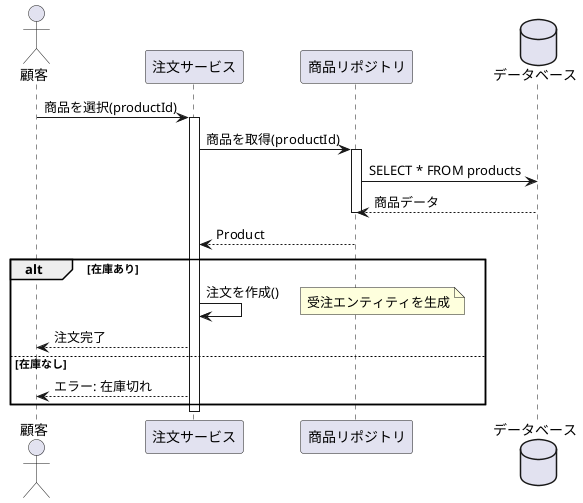
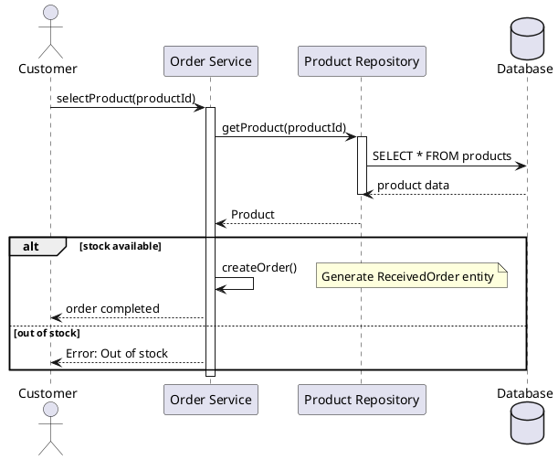
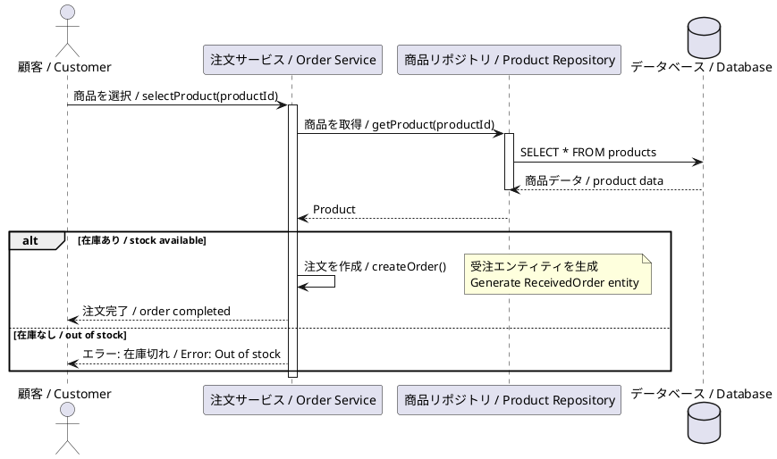
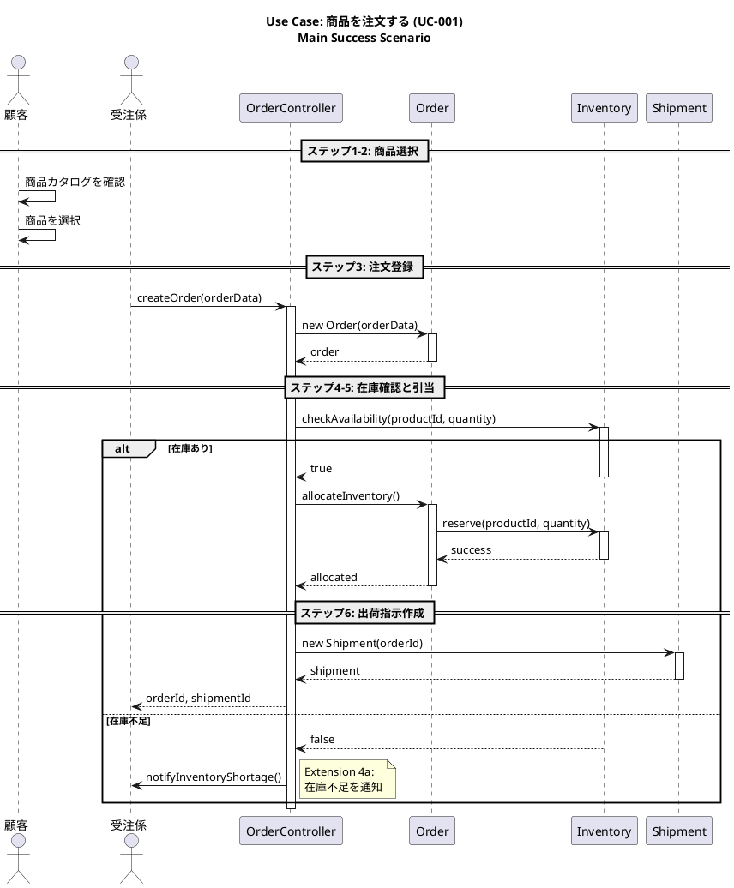

# Use Case to Sequence Diagram Generator v1

Generate comprehensive UML sequence diagrams from use case specifications and domain models.

## Overview / 概要

This skill creates sequence diagrams that illustrate how objects interact to fulfill each use case. These diagrams are critical for:
- Understanding runtime object behavior
- Implementing business logic correctly
- Designing API interactions
- Identifying missing methods or relationships
- Code generation with accurate message flows

**Key capabilities:**
- ✅ Generates sequence diagrams for each use case
- ✅ Includes main flow and extension flows
- ✅ Shows object creation, destruction, and state changes
- ✅ Captures synchronous and asynchronous messages
- ✅ Represents control structures (loops, conditionals)
- ✅ **MUST generate PlantUML (.puml) files** - MANDATORY OUTPUT
- ✅ Outputs JSON metadata and optional XMI formats
- ✅ **Multi-language diagram messages (Japanese/English/Bilingual)** ⭐ NEW!
- ✅ **Inherits language from domain model** ⭐ NEW!

---

## Language Support / 言語サポート ⭐

### Overview / 概要

This skill generates sequence diagrams with language-appropriate messages and notes, inheriting settings from the domain model.

**Supported Languages:**
- **Japanese (日本語)**: Messages and notes in Japanese
- **English**: Messages and notes in English
- **Bilingual (バイリンガル)**: Dual-language messages for international teams

### Language Scope

**What is localized:**
- ✅ Message labels (method calls)
- ✅ Return value labels
- ✅ Note content
- ✅ alt/loop/opt frame labels
- ✅ Activation descriptions

**What is NOT localized:**
- ✅ Object names (lifelines) - always use entity.name
- ✅ Method names - always English for code compatibility
- ✅ Parameter names - always English

### Language Inheritance

**Inherits from:** domain-model.json

**Priority:**
1. metadata.language (if present)
2. Inferred from entity descriptions
3. Default to English

### Example Output

#### Japanese Mode (language="ja")


#### English Mode (language="en")


#### Bilingual Mode (language="bilingual")


### Best Practices / ベストプラクティス

**Recommended settings:**
- **Japanese projects**: Messages in Japanese, method names in English
- **International projects**: All English
- **Mixed teams**: Bilingual mode for clear communication

---

## Position in Workflow / ワークフロー内の位置

```
Step 1: scenario-to-activity-v1
  ↓
Step 2: activity-to-usecase-v1
  ↓
Step 3: usecase-to-class-v1
  ↓ Domain model (authoritative)
Step 3.5: usecase-to-sequence-v1 ← YOU ARE HERE
  ↓ Sequence diagrams
Step 4: usecase-to-code-v1 (enhanced with sequence info)
```

**Why after class diagram:**
- Requires complete domain model with methods
- Needs entity relationships for message routing
- Uses business methods defined in class diagram

---

## Input / 入力

### Required

**1. Use case specifications:**
- `{project}_usecase-output.json`
- Or: Individual `usecase-specifications/*.md` files

**2. Domain model:**
- `{project}_domain-model.json` (from usecase-to-class-v1)
- **CRITICAL**: Must be the formal model, not inferred

### Optional

**3. Execution options:**
- `generate_xmi`: Boolean (default: true)
- `include_extensions`: Boolean (default: true)
- `show_return_messages`: Boolean (default: true)

---

## Workflow / 処理フロー

### Step 0: Language Configuration ⭐ NEW!

**0a. Load domain model:**
```python
domain_model = load_json(f'{project}_domain-model.json')
```

**0b. Extract language configuration:**
```python
# Inherit from domain model
if "metadata" in domain_model and "language" in domain_model["metadata"]:
    language = domain_model["metadata"]["language"]
else:
    # Infer from descriptions
    if domain_model.get("entities"):
        first_desc = domain_model["entities"][0].get("description", "")
        language = detect_language(first_desc)
    else:
        language = "en"
```

**0c. Configure diagram language:**
```python
diagram_config = {
    "message_language": language,      # ja | en | bilingual
    "note_language": language,         # Follow message language
    "frame_language": language,        # alt/loop/opt labels
    "object_names": "entity_name",     # Always use entity.name
    "method_names": "english"          # Always English
}
```

**0d. Load japanese_name mappings:**
```python
# Extract for message generation
japanese_names = {}
for entity in domain_model["entities"]:
    japanese_names[entity["name"]] = entity.get("japanese_name", entity["name"])
```

**0e. Display configuration:**
```
━━━━━━━━━━━━━━━━━━━━━━━━━━━━━━━━━━
🌐 Sequence Diagram Language Config
━━━━━━━━━━━━━━━━━━━━━━━━━━━━━━━━━━
Source: domain-model.json
Message labels: Japanese (日本語)
Notes: Japanese
Method names: English (for code)
━━━━━━━━━━━━━━━━━━━━━━━━━━━━━━━━━━
```

---

### Step 1: Load and Validate Inputs

**1a. Load use case definitions:**
```json
{
  "usecases": [
    {
      "id": "UC-001",
      "name": "商品を注文する",
      "primary_actor": "顧客",
      "main_success_scenario": [
        "1. 顧客が商品カタログを確認する",
        "2. 顧客が商品を選択する",
        "3. 受注係が注文内容を登録する",
        "4. システムが在庫を確認する",
        "5. システムが在庫を引き当てる",
        "6. システムが出荷指示を作成する"
      ],
      "extensions": [
        {
          "condition": "4a. 在庫不足の場合",
          "steps": [
            "4a1. システムが在庫不足を通知する",
            "4a2. 受注係が顧客に説明する",
            "4a3. ユースケース終了"
          ]
        }
      ]
    }
  ]
}
```

**1b. Load domain model:**
```json
{
  "entities": [
    {
      "name": "Order",
      "attributes": [...],
      "business_methods": [
        {
          "name": "create",
          "parameters": [...],
          "return_type": "Order"
        },
        {
          "name": "allocateInventory",
          "parameters": [],
          "return_type": "Boolean"
        }
      ]
    },
    {
      "name": "Inventory",
      "business_methods": [
        {
          "name": "checkAvailability",
          "parameters": [{"name": "productId", "type": "String"}],
          "return_type": "Boolean"
        }
      ]
    }
  ]
}
```

**1c. Validate consistency:**
- ✓ All entities referenced in use cases exist in domain model
- ✓ All business methods exist for interactions
- ⚠️ Flag missing methods for manual implementation

---

### Step 2: Extract Participants (Lifelines)

**2a. Identify actors:**
From use case `primary_actor` and `secondary_actors`

**2b. Identify system objects:**
Extract from use case flows using pattern matching:

```
Patterns:
"システムが在庫を確認する" → Object: Inventory
"注文内容を登録する" → Object: Order
"出荷指示を作成する" → Object: Shipment
```

**2c. Identify controllers/services:**
For use cases, create a controller/service object:
```
Use Case: "商品を注文する"
→ Controller: OrderController (or OrderService)
```

**2d. Result:**
```
Participants for UC-001:
- Actor: 顧客 (Customer)
- Actor: 受注係 (OrderClerk)
- Boundary: OrderController
- Entity: Order
- Entity: Inventory
- Entity: Shipment
```

---

### Step 3: Map Use Case Steps to Message Flows

**3a. Main success scenario mapping:**

For each step in main flow:

```
Step: "受注係が注文内容を登録する"
Analysis:
- Actor: 受注係
- Action: 登録する (register/create)
- Target: 注文 (Order)

Sequence:
受注係 -> OrderController: createOrder(orderData)
activate OrderController
OrderController -> Order: new Order(orderData)
activate Order
Order --> OrderController: order
deactivate Order
OrderController --> 受注係: orderId
deactivate OrderController
```

**3b. Identify control structures:**

**Conditionals:**
```
Step: "4. システムが在庫を確認する"
Extension: "4a. 在庫不足の場合"

Sequence:
alt 在庫あり
    Inventory --> OrderController: true
    ... continue normal flow
else 在庫不足
    Inventory --> OrderController: false
    OrderController -> 受注係: notifyInventoryShortage()
    ... extension flow
end
```

**Loops:**
```
Step: "各商品の在庫を確認する"

Sequence:
loop for each orderItem
    OrderController -> Inventory: checkAvailability(productId)
    Inventory --> OrderController: available
end
```

**3c. Identify asynchronous messages:**
```
Pattern: "通知する", "送信する"
→ Asynchronous message (dashed arrow)

Example:
OrderController ->> NotificationService: sendOrderConfirmation(orderId)
```

---

### Step 4: Generate PlantUML Sequence Diagrams ⭐ MANDATORY

**CRITICAL REQUIREMENT**: Always generate .puml files for visualization and documentation.

**4a. For each use case, generate diagram:**

**Structure:**


**4b. Generate extension flow diagrams:**

If `include_extensions` is true, create separate diagrams for complex extensions:

```plantuml
@startuml UC-001_Extension-4a_在庫不足_sequence

title Use Case: 商品を注文する (UC-001)\nExtension 4a: 在庫不足の場合

actor "受注係" as OrderClerk
actor "顧客" as Customer
participant "OrderController" as Controller
participant "Inventory" as Inventory

Controller -> Inventory: checkAvailability(productId, quantity)
activate Inventory
Inventory --> Controller: false (在庫不足)
deactivate Inventory

Controller -> OrderClerk: notifyInventoryShortage(productId)
activate OrderClerk

OrderClerk -> Customer: 説明する(在庫状況)
activate Customer

alt 顧客が注文変更を希望
    Customer --> OrderClerk: 変更内容
    deactivate Customer
    OrderClerk -> Controller: updateOrder(orderId, newItems)
    ... (メインフローのステップ3に戻る)
    
else 顧客がキャンセルを希望
    Customer --> OrderClerk: キャンセル
    deactivate Customer
    OrderClerk -> Controller: cancelOrder(orderId)
    Controller --> OrderClerk: cancelled
end

deactivate OrderClerk

@enduml
```

---

### Step 5: Generate Structured JSON Output

**Filename:** `{project}_sequence-diagrams.json`

**Schema:**
```json
{
  "metadata": {
    "source": "usecase-to-sequence-v1",
    "generated_at": "ISO 8601 timestamp",
    "version": "1.0",
    "input_usecases": "{project}_usecase-output.json",
    "input_domain_model": "{project}_domain-model.json"
  },
  "sequence_diagrams": [
    {
      "usecase_id": "UC-001",
      "usecase_name": "商品を注文する",
      "diagram_type": "main_flow",
      "participants": [
        {
          "id": "customer",
          "name": "顧客",
          "type": "actor"
        },
        {
          "id": "order_clerk",
          "name": "受注係",
          "type": "actor"
        },
        {
          "id": "order_controller",
          "name": "OrderController",
          "type": "boundary"
        },
        {
          "id": "order",
          "name": "Order",
          "type": "entity"
        },
        {
          "id": "inventory",
          "name": "Inventory",
          "type": "entity"
        }
      ],
      "messages": [
        {
          "sequence": 1,
          "from": "order_clerk",
          "to": "order_controller",
          "message": "createOrder(orderData)",
          "message_type": "synchronous",
          "return_message": "orderId",
          "activation": true
        },
        {
          "sequence": 2,
          "from": "order_controller",
          "to": "order",
          "message": "new Order(orderData)",
          "message_type": "create",
          "return_message": "order",
          "activation": true
        },
        {
          "sequence": 3,
          "from": "order_controller",
          "to": "inventory",
          "message": "checkAvailability(productId, quantity)",
          "message_type": "synchronous",
          "return_message": "Boolean",
          "activation": true,
          "control_structure": {
            "type": "alt",
            "condition": "在庫あり/在庫不足",
            "branches": [
              {
                "condition": "在庫あり",
                "next_sequence": 4
              },
              {
                "condition": "在庫不足",
                "extension_ref": "Extension-4a"
              }
            ]
          }
        }
      ],
      "fragments": [
        {
          "type": "alt",
          "condition": "在庫確認結果",
          "start_sequence": 3,
          "end_sequence": 8,
          "branches": [
            {
              "name": "在庫あり",
              "sequences": [4, 5, 6, 7, 8]
            },
            {
              "name": "在庫不足",
              "sequences": [9],
              "extension_ref": "4a"
            }
          ]
        }
      ],
      "notes": [
        {
          "sequence": 9,
          "position": "right",
          "text": "Extension 4a: 在庫不足を通知"
        }
      ]
    },
    {
      "usecase_id": "UC-001",
      "usecase_name": "商品を注文する",
      "diagram_type": "extension",
      "extension_id": "4a",
      "extension_name": "在庫不足の場合",
      "participants": [...],
      "messages": [...]
    }
  ],
  "method_calls_summary": [
    {
      "entity": "Order",
      "method": "create",
      "called_by": ["OrderController"],
      "call_count": 1,
      "usecases": ["UC-001"]
    },
    {
      "entity": "Inventory",
      "method": "checkAvailability",
      "called_by": ["OrderController", "Order"],
      "call_count": 2,
      "usecases": ["UC-001", "UC-003"]
    }
  ]
}
```

---

### Step 6: Generate XMI Model (Optional)

**Filename:** `{project}_sequence-model.xmi`

UML 2.5.1 Sequence Diagram in XMI 2.5.1 format.

**Structure:**
```xml
<?xml version="1.0" encoding="UTF-8"?>
<xmi:XMI xmi:version="2.5.1" 
         xmlns:xmi="http://www.omg.org/spec/XMI/20131001"
         xmlns:uml="http://www.omg.org/spec/UML/20161101">
  
  <uml:Model xmi:type="uml:Model" name="{project}">
    <packagedElement xmi:type="uml:Package" name="SequenceDiagrams">
      
      <!-- Sequence Diagram for UC-001 -->
      <packagedElement xmi:type="uml:Interaction" name="UC-001_商品を注文する">
        
        <!-- Lifelines -->
        <lifeline xmi:type="uml:Lifeline" name="顧客" 
                  represents="Customer"/>
        <lifeline xmi:type="uml:Lifeline" name="受注係" 
                  represents="OrderClerk"/>
        <lifeline xmi:type="uml:Lifeline" name="OrderController" 
                  represents="OrderController"/>
        <lifeline xmi:type="uml:Lifeline" name="Order" 
                  represents="Order"/>
        <lifeline xmi:type="uml:Lifeline" name="Inventory" 
                  represents="Inventory"/>
        
        <!-- Messages -->
        <fragment xmi:type="uml:MessageOccurrenceSpecification" 
                  name="createOrder_send"
                  covered="OrderClerk OrderController"/>
        
        <message xmi:type="uml:Message" 
                 name="createOrder"
                 messageSort="synchCall"
                 sendEvent="createOrder_send"
                 receiveEvent="createOrder_receive">
          <argument xmi:type="uml:LiteralString" value="orderData"/>
        </message>
        
        <!-- CombinedFragment (alt) -->
        <fragment xmi:type="uml:CombinedFragment" interactionOperator="alt">
          <operand xmi:type="uml:InteractionOperand" name="在庫あり">
            <guard xmi:type="uml:InteractionConstraint">
              <specification xmi:type="uml:LiteralString" 
                            value="checkAvailability() == true"/>
            </guard>
            <!-- Messages in this branch -->
          </operand>
          <operand xmi:type="uml:InteractionOperand" name="在庫不足">
            <guard xmi:type="uml:InteractionConstraint">
              <specification xmi:type="uml:LiteralString" 
                            value="checkAvailability() == false"/>
            </guard>
            <!-- Messages in this branch -->
          </operand>
        </fragment>
        
      </packagedElement>
    </packagedElement>
  </uml:Model>
</xmi:XMI>
```

---

### Step 7: Generate Documentation

**Filename:** `{project}_sequence-diagrams-guide.md`

**Contents:**
```markdown
# シーケンス図ガイド: {Project Name}

## 概要 / Overview

このドキュメントは、{Project Name}のシーケンス図を説明します。
各ユースケースのオブジェクト間相互作用を詳細に示しています。

---

## UC-001: 商品を注文する

### メインフロー

**参加者:**
- 顧客 (Actor)
- 受注係 (Actor)
- OrderController (Boundary)
- Order (Entity)
- Inventory (Entity)
- Shipment (Entity)

**メッセージフロー:**

1. **受注係 → OrderController**: `createOrder(orderData)`
   - 注文データを受け取り、注文処理を開始

2. **OrderController → Order**: `new Order(orderData)`
   - 新しい注文オブジェクトを生成

3. **OrderController → Inventory**: `checkAvailability(productId, quantity)`
   - 在庫の可用性を確認
   - **分岐点**: 在庫状況により処理が分岐

4. **[在庫あり]** の場合:
   - **Order → Inventory**: `reserve(productId, quantity)`
     - 在庫を予約・引当
   - **OrderController → Shipment**: `new Shipment(orderId)`
     - 出荷指示を作成
   - **OrderController → 受注係**: `orderId, shipmentId`
     - 成功を通知

5. **[在庫不足]** の場合:
   - **OrderController → 受注係**: `notifyInventoryShortage()`
   - Extension 4a へ

### 拡張フロー 4a: 在庫不足の場合

**メッセージフロー:**

1. **受注係 → 顧客**: 在庫状況を説明
2. **顧客の選択により分岐:**
   - **注文変更**: メインフローのステップ3へ戻る
   - **キャンセル**: 注文をキャンセルして終了

---

## 実装ガイド / Implementation Guide

### 必要なメソッド

**OrderController:**
- `createOrder(orderData): String` - 注文作成
- `updateOrder(orderId, newItems): void` - 注文更新
- `cancelOrder(orderId): void` - 注文キャンセル
- `notifyInventoryShortage(productId): void` - 在庫不足通知

**Order:**
- `constructor(orderData)` - コンストラクタ
- `allocateInventory(): Boolean` - 在庫引当

**Inventory:**
- `checkAvailability(productId, quantity): Boolean` - 在庫確認
- `reserve(productId, quantity): Boolean` - 在庫予約

**Shipment:**
- `constructor(orderId)` - コンストラクタ

### メッセージングパターン

**同期呼び出し (Synchronous Call):**
```typescript
// 呼び出し側は応答を待つ
const result = await inventory.checkAvailability(productId, quantity);
```

**非同期メッセージ (Asynchronous Message):**
```typescript
// 呼び出し側は応答を待たない
notificationService.sendOrderConfirmation(orderId);
```

---

*生成日時: {timestamp}*
*生成ツール: usecase-to-sequence-v1*
*バージョン: 1.0*
```

---

## Output / 出力

### Generated Files

For each project:

1. **PlantUML Sequence Diagrams** ⭐ **MANDATORY - MUST BE GENERATED**
   - `UC-{ID}_{name}_sequence.puml` (main flow) - **REQUIRED**
   - `UC-{ID}_Extension-{ext}_sequence.puml` (extension flows) - if applicable
   - One .puml file per use case - **ALWAYS CREATE THESE FILES**
   - **CRITICAL**: These PlantUML files are NOT optional. Always generate them.

2. **Structured JSON** (Required)
   - `{project}_sequence-diagrams.json`
   - Machine-readable format for code generation

3. **Documentation** (Required)
   - `{project}_sequence-diagrams-guide.md`
   - Human-readable explanation

4. **XMI Model** (Optional)
   - `{project}_sequence-model.xmi`
   - UML 2.5.1 / XMI 2.5.1 format

---

## Message Type Classification / メッセージタイプ分類

### Synchronous Messages (solid arrow →)
- Method calls that wait for return value
- Example: `checkAvailability()`, `create()`

### Asynchronous Messages (dashed arrow ->>)
- Fire-and-forget messages
- Example: `sendNotification()`, `publishEvent()`

### Return Messages (dashed arrow ←--)
- Return values from method calls
- Only shown if `show_return_messages` is true

### Create Messages (solid arrow with «create»)
- Object instantiation
- Example: `new Order()`, `new Shipment()`

### Destroy Messages (solid arrow with «destroy»)
- Object destruction (rare in business applications)

---

## Control Structures / 制御構造

### alt (Alternative)
```plantuml
alt 条件1
    ... messages
else 条件2
    ... messages
else 条件3
    ... messages
end
```

### opt (Optional)
```plantuml
opt 条件
    ... messages (executed if condition is true)
end
```

### loop (Iteration)
```plantuml
loop for each item
    ... messages (repeated)
end
```

### par (Parallel)
```plantuml
par
    ... concurrent messages
and
    ... concurrent messages
end
```

---

## Best Practices / ベストプラクティス

### For Quality

1. **Keep diagrams focused**: One diagram per use case main flow
2. **Show business logic**: Include decision points and branches
3. **Name messages clearly**: Use business domain terminology
4. **Group related messages**: Use fragments for cohesion
5. **Indicate return types**: Show important return values

### For Implementation

1. **Every message becomes a method**: Ensure all methods exist in class diagram
2. **Validate participants**: All objects must be defined in domain model
3. **Check cardinality**: Loops should align with relationships
4. **Verify timing**: Asynchronous calls should be marked correctly

### For Maintenance

1. **Version control diagrams**: Treat as code artifacts
2. **Update with use cases**: Keep synchronized with specifications
3. **Review with stakeholders**: Validate business logic flows
4. **Generate documentation**: Always include markdown guide

---

## Integration with Other Skills / 他スキルとの連携

### Input Dependencies

**Required:**
- `usecase-to-class-v1` → Provides domain model with business methods
- `activity-to-usecase-v1` → Provides use case specifications

**Enhances:**
- `usecase-to-code-v1` → Use sequence info for accurate method implementation
- `model-validator-v1` → Validate consistency between sequence and class diagrams

### Workflow Position

```
scenario-to-activity-v1
  ↓
activity-to-usecase-v1
  ↓
usecase-to-class-v1
  ↓
usecase-to-sequence-v1 ← Adds behavioral view
  ↓
usecase-to-code-v1 (enhanced)
```

---

## Common Patterns / よくあるパターン

### Entity Creation Pattern
```plantuml
Controller -> Entity: new Entity(data)
activate Entity
Entity --> Controller: entity
deactivate Entity
```

### Service Call Pattern
```plantuml
Controller -> Service: operation(params)
activate Service
Service -> Repository: find(id)
Repository --> Service: entity
Service -> Entity: businessMethod()
Entity --> Service: result
Service --> Controller: response
deactivate Service
```

### Validation Pattern
```plantuml
Controller -> Validator: validate(data)
activate Validator

alt validation passed
    Validator --> Controller: valid
    ... continue normal flow
else validation failed
    Validator --> Controller: errors
    Controller -> Actor: displayErrors(errors)
end

deactivate Validator
```

### Event Publishing Pattern
```plantuml
Service -> Entity: update(data)
activate Entity
Entity -> Entity: applyChanges()
Entity ->> EventBus: OrderUpdatedEvent
note right: Asynchronous
Entity --> Service: success
deactivate Entity
```

---

## Validation Checklist / 確認チェックリスト

Before finalizing sequence diagrams:

- [ ] All participants defined in domain model
- [ ] All messages correspond to methods in class diagram
- [ ] Return types match method signatures
- [ ] Control structures align with use case extensions
- [ ] Asynchronous messages identified correctly
- [ ] Object lifecycles (create/destroy) shown
- [ ] Activation bars used consistently
- [ ] PlantUML syntax is valid
- [ ] JSON output is well-formed
- [ ] Documentation is complete

---

## Limitations / 制限事項

**This skill does NOT:**
- ❌ Generate code implementations (use usecase-to-code-v1)
- ❌ Create component diagrams (different abstraction level)
- ❌ Show deployment details (use deployment diagrams)
- ❌ Validate business logic correctness (requires human review)

**What it DOES:**
- ✅ Visualize object interactions
- ✅ Identify required methods
- ✅ Show control flow logic
- ✅ Support code generation planning

---

## Version History / バージョン履歴

- **v1.0** (2026-01-30): Initial version
  - Main flow sequence generation
  - Extension flow support
  - PlantUML, JSON, XMI outputs
  - Control structure handling
  - Integration with v1 workflow
