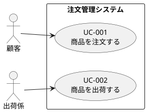
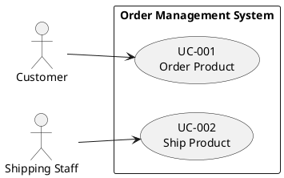
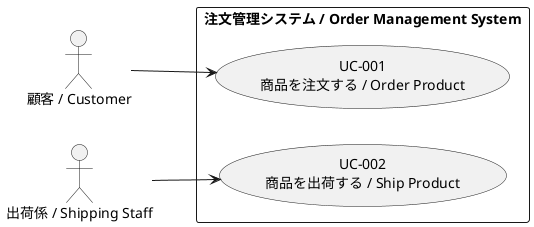
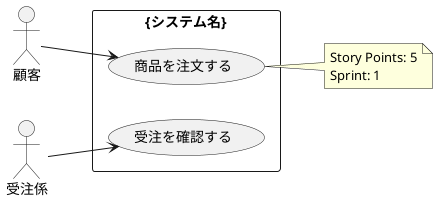

# Use Case Markdown to JSON and Diagram Converter

Convert Cockburn-format Markdown use case specifications to structured JSON format and PlantUML use case diagram.

## Overview

This skill enables **Markdown-first workflow** by converting human-readable use case specifications into both machine-readable JSON format and visual PlantUML use case diagram. After editing Markdown files, this skill automatically synchronizes changes to `usecase-output.json` and `{project}_usecase-diagram.puml`.

**Key benefits:**
- ✅ Edit use cases in readable Markdown format
- ✅ Automatically generate JSON for Step 3 and Step 4
- ✅ Automatically regenerate use case diagram for visualization
- ✅ Maintain Markdown as Single Source of Truth
- ✅ Eliminate manual JSON and diagram synchronization

---

## Language Support ⭐ NEW!

Generates PlantUML use case diagrams with language-appropriate labels for actors and use cases. Inherits language settings from existing usecase-output.json.

### Step 0: Language Configuration

**Automatic inheritance:**
```python
# Read language from existing usecase-output.json
if os.path.exists('usecase-output.json'):
    existing_data = load_json('usecase-output.json')
    language = existing_data.get('language_config', {}).get('language', 'en')
else:
    # Default to English for new projects
    language = 'en'
```

**Supported outputs:**
- PlantUML use case diagrams: Japanese/English/Bilingual actor and use case labels
- JSON: Includes japanese_name for all entities
- Markdown: Language determined by UC-*.md files

### Output Examples

#### Use Case Diagram (language="ja")


#### Use Case Diagram (language="en")


#### Use Case Diagram (language="bilingual")


**Note:** Language setting is inherited from usecase-output.json. When creating new UC-*.md files, the diagram labels will automatically follow the project's language setting.

---

## Position in Workflow

### Before usecase-md-to-json (v1.2 and earlier)

```
Step 2: activity-to-usecase-v1.1
  ↓
  ├─→ UC-*.md (Markdown) ──X─→ Not used in Step 3, 4
  ├─→ usecase-diagram.puml ──X─→ Not updated on edits
  └─→ usecase-output.json ──✓─→ Step 3 → Step 4

Problem: Markdown edits don't affect final code or diagram
```

### After usecase-md-to-json (v2.0+)

```
Step 2: activity-to-usecase-v1.1
  ↓
  ├─→ UC-*.md (Markdown) ←─── Edit here! (Single Source of Truth)
  ├─→ usecase-diagram.puml
  └─→ usecase-output.json
        ↓
[Review & Edit UC-*.md files / Add new UC-*.md]
        ↓
Step 2.5: usecase-md-to-json ← UPDATED!
  ↓
  ├─→ usecase-output.json (updated) ──✓─→ Step 3 → Step 4
  └─→ usecase-diagram.puml (regenerated) ──✓─→ Visualization

Solution: Markdown edits automatically reflected in code AND diagram
```

---

## Use Cases

### Use Case 1: After Reviewing Markdown Specifications

```
Scenario: Business analyst reviews UC-001_商品を注文する.md 
and changes story points from 8 to 5.

Workflow:
1. Edit UC-001_商品を注文する.md
2. Run usecase-md-to-json
3. usecase-output.json is updated automatically
4. Proceed to Step 3 (usecase-to-class-v1)
```

### Use Case 2: Adding New Extension Flow

```
Scenario: Developer adds "5a. 商品が在庫切れの場合" to UC-001.

Workflow:
1. Edit UC-001_商品を注文する.md
   Add extension flow in Extensions section
2. Run usecase-md-to-json
3. New extension appears in usecase-output.json
4. Code generation reflects the new flow
```

### Use Case 3: Adding New Use Case

```
Scenario: Developer adds a new use case UC-004.

Workflow:
1. Create new file: UC-004_在庫を補充する.md
2. Follow Cockburn template format
3. Run usecase-md-to-json
4. New use case appears in:
   - usecase-output.json
   - usecase-diagram.puml (new actor and use case added)
5. Code generation includes the new use case
```

---

## Input

### Required

**Markdown use case specifications:**
```
usecase-specifications/
  ├── UC-001_商品を注文する.md
  ├── UC-002_受注を出荷する.md
  └── UC-003_xxx.md
```

**Format:** Cockburn Use Case Format (as generated by activity-to-usecase-v1.1)

### Optional

**Existing usecase-output.json:**
- If exists: Merge and update
- If not exists: Create new file

**Original metadata:**
- Preserved from existing JSON
- Includes generation timestamp, tool version, etc.

---

## Output

### Primary Outputs

**1. usecase-output.json** (updated or created)

Complete use case definition in JSON format compatible with:
- usecase-to-class-v1 (Step 3)
- usecase-to-code-v1 (Step 4)

**2. {project}_usecase-diagram.puml** (regenerated)

PlantUML use case diagram showing:
- All actors extracted from UC-*.md files
- All use cases with IDs and names
- Actor-to-use-case relationships
- Story points annotations
- System boundary

### Structure

**JSON Structure:**

```json
{
  "metadata": {
    "source": "usecase-specifications/*.md",
    "generated_at": "2026-01-24T...",
    "tool": "usecase-md-to-json",
    "version": "2.0",
    "original_source": "activity-to-usecase-v1",
    "last_updated": "2026-01-24T..."
  },
  "system": {
    "name": "システム名",
    "description": "システム概要"
  },
  "actors": [...],
  "usecases": [
    {
      "id": "UC-001",
      "name": "商品を注文する",
      "actor": "Customer",
      "story_points": 5,
      "main_flow": [...],
      "extensions": [...],
      "api_operations": [...]
    }
  ],
  "domain_model": {...}
}
```

**Use Case Diagram Structure (PlantUML):**



---

## Workflow

### Step 1: Scan Markdown Files

**1a. Find all UC-*.md files:**
```bash
find usecase-specifications/ -name "UC-*.md" | sort
```

**1b. Extract use case IDs:**
```
UC-001_商品を注文する.md → UC-001
UC-002_受注を出荷する.md → UC-002
```

---

### Step 2: Parse Each Markdown File

**2a. Read file content**

**2b. Parse Cockburn format sections:**

```markdown
# UC-001: 商品を注文する

## ユースケース概要
- **ID**: UC-001
- **名称**: 商品を注文する
- **主アクター**: 顧客 (Customer)
- **ストーリーポイント**: 5
- **スプリント**: 1
- **優先度**: 高

## ステークホルダーと関心事
| ステークホルダー | 関心事 |
|----------------|--------|
| 顧客 | 簡単に注文したい |

## 事前条件
- システムが稼働している
- 商品カタログが利用可能

## 成功保証（事後条件）
- 注文が登録されている
- 在庫が引き当てられている

## 主成功シナリオ
1. 顧客が商品カタログを確認する
2. 顧客が商品を選択する
3. 顧客が注文内容を確認する

## 拡張（代替フロー）
**4a. 新規顧客の場合:**
- 4a1. 顧客情報を登録する
- 4a2. ステップ4に戻る

**5a. 商品が在庫切れの場合:**
- 5a1. システムが在庫切れを通知する
- 5a2. ステップ2に戻る

## 特別要件
**性能要件:**
- 注文登録の処理: 3秒以内

**セキュリティ要件:**
- 顧客情報は暗号化

## 技術とデータのバリエーション
- 日付形式: YYYY-MM-DD

## 発生頻度
- 1日あたり100-500件

## API操作
| メソッド | エンドポイント | 説明 |
|---------|---------------|------|
| GET | /api/products | 商品一覧取得 |
| POST | /api/orders | 注文作成 |
```

**2c. Extract structured data:**

```python
usecase = {
    "id": "UC-001",
    "name": "商品を注文する",
    "actor": "Customer",
    "scope": "受注出荷管理システム",
    "level": "user-goal",
    "story_points": 5,
    "sprint": 1,
    "priority": "high",
    "stakeholders": [
        {
            "name": "顧客",
            "interest": "簡単に注文したい"
        }
    ],
    "preconditions": [
        "システムが稼働している",
        "商品カタログが利用可能"
    ],
    "success_guarantee": [
        "注文が登録されている",
        "在庫が引き当てられている"
    ],
    "main_flow": [
        "1. 顧客が商品カタログを確認する",
        "2. 顧客が商品を選択する",
        "3. 顧客が注文内容を確認する"
    ],
    "extensions": [
        {
            "step": "4a",
            "condition": "新規顧客の場合",
            "actions": [
                "4a1. 顧客情報を登録する",
                "4a2. ステップ4に戻る"
            ]
        },
        {
            "step": "5a",
            "condition": "商品が在庫切れの場合",
            "actions": [
                "5a1. システムが在庫切れを通知する",
                "5a2. ステップ2に戻る"
            ]
        }
    ],
    "special_requirements": {
        "performance": ["注文登録の処理: 3秒以内"],
        "security": ["顧客情報は暗号化"]
    },
    "technology_variations": ["日付形式: YYYY-MM-DD"],
    "frequency": "1日あたり100-500件",
    "api_operations": [
        {
            "method": "GET",
            "endpoint": "/api/products",
            "description": "商品一覧取得"
        },
        {
            "method": "POST",
            "endpoint": "/api/orders",
            "description": "注文作成"
        }
    ]
}
```

---

### Step 3: Load Existing JSON (if exists)

**3a. Check for usecase-output.json:**
```python
if os.path.exists('usecase-output.json'):
    with open('usecase-output.json', 'r') as f:
        existing_data = json.load(f)
else:
    existing_data = None
```

**3b. Preserve metadata and domain model:**
```python
if existing_data:
    metadata = existing_data.get('metadata', {})
    domain_model = existing_data.get('domain_model', {})
    actors = existing_data.get('actors', [])
else:
    metadata = create_default_metadata()
    domain_model = {}
    actors = []
```

---

### Step 4: Merge and Update

**4a. Update metadata:**
```json
{
  "metadata": {
    "source": "usecase-specifications/*.md",
    "original_source": "activity-to-usecase-v1",
    "generated_at": "original timestamp",
    "last_updated": "current timestamp",
    "tool": "usecase-md-to-json",
    "version": "1.0"
  }
}
```

**4b. Merge use cases:**

Strategy:
- Match by ID (UC-001, UC-002, etc.)
- If ID exists in JSON: **Update** (Markdown takes precedence)
- If ID is new: **Add**
- If ID missing from Markdown but in JSON: **Keep** (don't delete automatically)

**4c. Extract and merge actors:**

From Markdown:
```markdown
## ユースケース概要
- **主アクター**: 顧客 (Customer)
```

Update actors list:
```json
{
  "actors": [
    {
      "name": "Customer",
      "japanese_name": "顧客",
      "description": "商品を購入する利用者"
    }
  ]
}
```

**4d. Preserve domain model:**

Domain model from Step 2 (activity-to-usecase) should be preserved:
```json
{
  "domain_model": {
    "source": "inferred",
    "entities": [...],
    "note": "Preserved from original generation"
  }
}
```

---

### Step 5: Validate Generated JSON

**5a. Structure validation:**
- ✅ All required fields present
- ✅ ID format: UC-XXX
- ✅ Story points: 1-13
- ✅ Priority: high|medium|low

**5b. Consistency checks:**
- ✅ Actors referenced in use cases exist in actors list
- ✅ Extension steps reference valid main flow steps
- ✅ API operations have method and endpoint

**5c. Warning detection:**
```
⚠️ Warning: UC-004 found in JSON but not in Markdown
⚠️ Warning: Actor "SystemAdmin" used in UC-005 but not defined
⚠️ Warning: Extension step "7a" but main flow has only 5 steps
```

---

### Step 6: Write Output

**6a. Format JSON:**
```python
import json

output = {
    "metadata": metadata,
    "system": system_info,
    "actors": actors,
    "usecases": usecases,
    "domain_model": domain_model
}

with open('usecase-output.json', 'w', encoding='utf-8') as f:
    json.dump(output, f, indent=2, ensure_ascii=False)
```

**6b. Create backup:**
```python
if os.path.exists('usecase-output.json'):
    shutil.copy('usecase-output.json', 'usecase-output.json.backup')
```

---

### Step 7: Generate PlantUML Use Case Diagram

**CRITICAL: Regenerate use case diagram from JSON to maintain consistency with Markdown changes.**

**7a. Extract diagram information from JSON:**

```python
def generate_usecase_diagram(usecase_data: dict, project_name: str) -> str:
    """
    Generate PlantUML use case diagram from usecase data
    
    Returns complete .puml file content
    """
    puml_lines = []
    
    # Header
    puml_lines.append(f"@startuml {project_name}_usecase")
    puml_lines.append("left to right direction")
    puml_lines.append("skinparam packageStyle rectangle")
    puml_lines.append("")
    
    # Actors
    actors = usecase_data.get('actors', [])
    actor_map = {}  # Map actor name to alias
    
    for idx, actor in enumerate(actors):
        actor_name = actor.get('name', '')
        japanese_name = actor.get('japanese_name', actor_name)
        alias = actor_name.lower().replace(' ', '_')
        actor_map[actor_name] = alias
        puml_lines.append(f"actor {japanese_name} as {alias}")
    
    puml_lines.append("")
    
    # System boundary
    system_name = usecase_data.get('system', {}).get('name', 'システム')
    puml_lines.append(f'rectangle "{system_name}" {{')
    
    # Use cases
    usecase_map = {}  # Map use case ID to alias
    for usecase in usecase_data.get('usecases', []):
        uc_id = usecase.get('id', '')
        uc_name = usecase.get('name', '')
        alias = uc_id.replace('-', '')
        usecase_map[uc_id] = alias
        puml_lines.append(f'  usecase "{uc_name}" as {alias}')
    
    puml_lines.append("}")
    puml_lines.append("")
    
    # Relationships (actor to use case)
    for usecase in usecase_data.get('usecases', []):
        uc_id = usecase.get('id', '')
        actor_name = usecase.get('actor', '')
        
        if actor_name in actor_map and uc_id in usecase_map:
            actor_alias = actor_map[actor_name]
            uc_alias = usecase_map[uc_id]
            puml_lines.append(f"{actor_alias} --> {uc_alias}")
    
    puml_lines.append("")
    
    # Story points annotations
    for usecase in usecase_data.get('usecases', []):
        uc_id = usecase.get('id', '')
        story_points = usecase.get('story_points', 0)
        sprint = usecase.get('sprint', 1)
        
        if uc_id in usecase_map:
            uc_alias = usecase_map[uc_id]
            puml_lines.append(f"note right of {uc_alias}")
            puml_lines.append(f"  Story Points: {story_points}")
            puml_lines.append(f"  Sprint: {sprint}")
            puml_lines.append("end note")
            puml_lines.append("")
    
    puml_lines.append("@enduml")
    
    return "\n".join(puml_lines)
```

**7b. Write diagram file:**

```python
diagram_content = generate_usecase_diagram(output, project_name)

with open(f'{project_name}_usecase-diagram.puml', 'w', encoding='utf-8') as f:
    f.write(diagram_content)
```

**7c. Backup existing diagram (if exists):**

```python
diagram_path = f'{project_name}_usecase-diagram.puml'
if os.path.exists(diagram_path):
    shutil.copy(diagram_path, f'{diagram_path}.backup')
```

---

## Markdown Parsing Rules

### Section Mapping

| Markdown Section | JSON Field |
|-----------------|------------|
| # UC-XXX: [name] | id, name |
| ## ユースケース概要 | id, name, actor, story_points, sprint, priority |
| ## ステークホルダーと関心事 | stakeholders |
| ## 事前条件 | preconditions |
| ## 成功保証（事後条件） | success_guarantee |
| ## 主成功シナリオ | main_flow |
| ## 拡張（代替フロー） | extensions |
| ## 特別要件 | special_requirements |
| ## 技術とデータのバリエーション | technology_variations |
| ## 発生頻度 | frequency |
| ## 未解決事項 | open_issues |
| ## 関連ユースケース | related_usecases |
| ## API操作 | api_operations |

### Pattern Recognition

**Use Case ID:**
```markdown
# UC-001: 商品を注文する
```
→ Extract: `id="UC-001"`, `name="商品を注文する"`

**Story Points:**
```markdown
- **ストーリーポイント**: 5
```
→ Extract: `story_points=5`

**Main Flow:**
```markdown
## 主成功シナリオ
1. 顧客が商品カタログを確認する
2. 顧客が商品を選択する
```
→ Extract: `main_flow=["1. 顧客が商品カタログを確認する", "2. 顧客が商品を選択する"]`

**Extensions:**
```markdown
**4a. 新規顧客の場合:**
- 4a1. 顧客情報を登録する
- 4a2. ステップ4に戻る
```
→ Extract:
```json
{
  "step": "4a",
  "condition": "新規顧客の場合",
  "actions": [
    "4a1. 顧客情報を登録する",
    "4a2. ステップ4に戻る"
  ]
}
```

**API Operations Table:**
```markdown
| メソッド | エンドポイント | 説明 |
|---------|---------------|------|
| GET | /api/products | 商品一覧取得 |
```
→ Extract:
```json
{
  "method": "GET",
  "endpoint": "/api/products",
  "description": "商品一覧取得"
}
```

---

## Error Handling

### Missing Required Sections

**Problem:** UC-001.md is missing "主成功シナリオ"

**Action:**
```
⚠️ Warning: UC-001 missing required section: 主成功シナリオ
→ Use empty array: main_flow=[]
→ Continue processing
```

### Malformed Content

**Problem:** Story points is not a number

```markdown
- **ストーリーポイント**: Very Complex
```

**Action:**
```
⚠️ Warning: UC-001 story_points is not numeric: "Very Complex"
→ Use default: story_points=5
→ Log warning
```

### Duplicate IDs

**Problem:** Two files have UC-001

**Action:**
```
❌ Error: Duplicate use case ID: UC-001
  - UC-001_商品を注文する.md
  - UC-001_注文処理.md
→ Abort processing
→ User must resolve
```

### Orphaned JSON Entries

**Problem:** usecase-output.json has UC-005 but no UC-005.md

**Action:**
```
⚠️ Warning: UC-005 in JSON but no corresponding .md file
→ Keep UC-005 in output (don't delete)
→ Log warning
→ User can manually remove if needed
```

---

## Usage Examples

### Example 1: Update Story Points

**Before:**
```markdown
# UC-001_商品を注文する.md
- **ストーリーポイント**: 8
```

**Edit:**
```markdown
- **ストーリーポイント**: 5
```

**Run:**
```
ユーザー: 「usecase-md-to-jsonを実行してください」

Claude:
1. Parsing UC-001_商品を注文する.md...
2. Story points changed: 8 → 5
3. Updating usecase-output.json...
4. Done! Changes saved.
```

**Result:**
```json
{
  "usecases": [
    {
      "id": "UC-001",
      "story_points": 5  // Updated!
    }
  ]
}
```

---

### Example 2: Add Extension Flow

**Edit UC-001.md:**
```markdown
## 拡張（代替フロー）

**5a. 商品が在庫切れの場合:**
- 5a1. システムが在庫切れを通知する
- 5a2. 顧客に在庫状況を説明する
- 5a3. ステップ2に戻る
```

**Run:**
```
ユーザー: 「usecase-md-to-jsonを実行してください」

Claude:
1. Parsing UC-001_商品を注文する.md...
2. New extension found: 5a. 商品が在庫切れの場合
3. Updating usecase-output.json...
4. Done!
```

**Result:**
```json
{
  "usecases": [
    {
      "id": "UC-001",
      "extensions": [
        {
          "step": "5a",
          "condition": "商品が在庫切れの場合",
          "actions": [
            "5a1. システムが在庫切れを通知する",
            "5a2. 顧客に在庫状況を説明する",
            "5a3. ステップ2に戻る"
          ]
        }
      ]
    }
  ]
}
```

---

### Example 3: Bulk Update

**Edit multiple files:**
- UC-001_商品を注文する.md: Change story points
- UC-002_受注を出荷する.md: Add new extension
- UC-003_在庫を管理する.md: Update API operations

**Run:**
```
ユーザー: 「usecase-md-to-jsonを実行してください」

Claude:
1. Found 3 use case files
2. Parsing UC-001_商品を注文する.md...
   - Story points: 8 → 5
3. Parsing UC-002_受注を出荷する.md...
   - New extension: 3a
4. Parsing UC-003_在庫を管理する.md...
   - API operations updated
5. Merging with existing usecase-output.json...
6. All changes saved!

Summary:
- 3 use cases updated
- 0 use cases added
- 0 warnings
```

---

### Example 4: Add New Use Case

**Create new file: UC-004_在庫を補充する.md**

```markdown
# UC-004: 在庫を補充する

## ユースケース概要
- **ID**: UC-004
- **名称**: 在庫を補充する
- **主アクター**: 倉庫管理者 (WarehouseManager)
- **ストーリーポイント**: 5
- **スプリント**: 2
- **優先度**: 中

## 主成功シナリオ
1. 倉庫管理者が在庫一覧を確認する
2. 倉庫管理者が補充が必要な商品を選択する
3. システムが補充数量を入力する
4. システムが在庫を更新する

## API操作
| メソッド | エンドポイント | 説明 |
|---------|---------------|------|
| GET | /api/inventory | 在庫一覧取得 |
| POST | /api/inventory/replenish | 在庫補充 |
```

**Run:**
```
ユーザー: 「usecase-md-to-jsonを実行してください」

Claude:
1. Found 4 use case files (1 new)
2. Parsing UC-001_商品を注文する.md... (unchanged)
3. Parsing UC-002_受注を出荷する.md... (unchanged)
4. Parsing UC-003_在庫を管理する.md... (unchanged)
5. Parsing UC-004_在庫を補充する.md... (NEW!)
   - New use case added: UC-004
   - New actor: WarehouseManager
6. Updating usecase-output.json...
7. Regenerating usecase-diagram.puml...
   - Added actor: 倉庫管理者
   - Added use case: UC-004 (在庫を補充する)
8. All changes saved!

Summary:
- 4 use cases processed
- 1 use case added (UC-004)
- 1 new actor added (WarehouseManager)
```

**Result JSON:**
```json
{
  "actors": [
    {"name": "Customer", "japanese_name": "顧客"},
    {"name": "Clerk", "japanese_name": "受注係"},
    {"name": "WarehouseManager", "japanese_name": "倉庫管理者"}  // NEW!
  ],
  "usecases": [
    {"id": "UC-001", "name": "商品を注文する", ...},
    {"id": "UC-002", "name": "受注を出荷する", ...},
    {"id": "UC-003", "name": "在庫を管理する", ...},
    {"id": "UC-004", "name": "在庫を補充する", "actor": "WarehouseManager", ...}  // NEW!
  ]
}
```

**Result Diagram:**
```plantuml
@startuml project_usecase
actor 顧客 as customer
actor 受注係 as clerk
actor 倉庫管理者 as warehousemanager  // NEW!

rectangle "システム" {
  usecase "商品を注文する" as UC001
  usecase "受注を出荷する" as UC002
  usecase "在庫を管理する" as UC003
  usecase "在庫を補充する" as UC004  // NEW!
}

customer --> UC001
clerk --> UC002
clerk --> UC003
warehousemanager --> UC004  // NEW!
@enduml
```

---

## Integration with Workflow

### Option 1: Manual Step (Recommended for v1.3)

```
Step 2: activity-to-usecase-v1.1
  ↓
  Generate: UC-*.md + usecase-output.json
  ↓
[Review & Edit Markdown files]
  ↓
Step 2.5: usecase-md-to-json (manual)
  ↓
  Update: usecase-output.json
  ↓
Step 3: usecase-to-class-v1
  ↓
Step 4: usecase-to-code-v1
```

**User command:**
```
ユーザー: 「usecase-md-to-jsonを実行してください」
```

---

### Option 2: Automatic in uml-workflow (Future)

Add execution option in uml-workflow-v1.3+:

```
質問3: ユースケースMarkdownファイルを確認・修正しますか？
  はい → Step 2完了後に一時停止
       → ユーザーがMarkdown編集
       → usecase-md-to-json自動実行
       → Step 3へ進む
  いいえ → Step 2から直接Step 3へ
```

---

## Best Practices

### 1. Always Backup Before Running

```bash
cp usecase-output.json usecase-output.json.backup
```

### 2. Validate Markdown Format

Before running usecase-md-to-json, ensure:
- ✅ File names match: UC-XXX_name.md
- ✅ Required sections present
- ✅ Proper Markdown table format for API operations

### 3. Review Generated JSON

After running:
```bash
# Check differences
diff usecase-output.json.backup usecase-output.json

# Or use Git
git diff usecase-output.json
```

### 4. Version Control

```bash
git add usecase-specifications/*.md
git add usecase-output.json
git add {project}_usecase-diagram.puml
git commit -m "docs: Update UC-001 story points 8→5"
```

---

## Limitations

### Current Limitations (v2.0)

1. **One-way sync only**
   - Markdown → JSON + Diagram ✅
   - JSON → Markdown ❌ (future feature)
   - Diagram → Markdown ❌ (future feature)

2. **Markdown format must match Cockburn template**
   - Non-standard sections ignored
   - Custom formatting may be lost

3. **No automatic deletion**
   - Removed .md files don't delete JSON entries or diagram elements
   - Manual cleanup required

4. **Limited validation**
   - Structure validation only
   - Business logic not validated

5. **Diagram relationship inference**
   - Only basic actor-to-use-case relationships generated
   - Include/extend relationships not inferred (manual addition in diagram required)

### Workarounds

**For deleted use cases:**
```json
// Manually remove from usecase-output.json
// Or use json-to-models after cleanup
```

**For custom sections:**
```markdown
// Add custom info in "未解決事項" or "関連ユースケース"
// Will be preserved in JSON
```

---

## Troubleshooting

### Issue: "No .md files found"

**Cause:** Wrong directory or files not following naming convention

**Solution:**
```bash
# Check files exist
ls usecase-specifications/UC-*.md

# Ensure naming: UC-001_name.md (not uc-001 or UC001)
```

---

### Issue: "JSON parse error"

**Cause:** Existing usecase-output.json is corrupted

**Solution:**
```bash
# Validate JSON
cat usecase-output.json | python -m json.tool

# Or restore backup
cp usecase-output.json.backup usecase-output.json
```

---

### Issue: "Story points not updated"

**Cause:** Markdown format doesn't match expected pattern

**Check:**
```markdown
# Correct format:
- **ストーリーポイント**: 5

# Incorrect:
- Story Points: 5
- **SP**: 5
```

---

## Output Summary

After successful execution, Claude provides:

```
✅ usecase-md-to-json completed successfully!

📊 Summary:
- Markdown files processed: 3
- Use cases updated: 2
- Use cases added: 0
- Use cases unchanged: 1
- Warnings: 0

📝 Changes:
- UC-001: Story points 8 → 5
- UC-002: New extension added (3a)

📄 Output:
- usecase-output.json (updated)
- usecase-output.json.backup (previous version)
- {project}_usecase-diagram.puml (regenerated)
- {project}_usecase-diagram.puml.backup (previous version)

✨ Next steps:
1. Review usecase-output.json
2. Review {project}_usecase-diagram.puml
3. Run usecase-to-class-v1 (Step 3)
4. Run usecase-to-code-v1 (Step 4)
```

---

## Version History

**v2.0** (2026-02-01)
- Added PlantUML use case diagram generation
- Diagram automatically regenerated from Markdown changes
- Support for new use case additions via Markdown
- Maintains Markdown as Single Source of Truth
- Diagram reflects all changes: new use cases, updated actors, modified story points

**v1.0** (2026-01-24)
- Initial release
- Markdown to JSON conversion
- Merge with existing JSON
- Basic validation
- Cockburn format parsing

---

**Generated by:** UML Workflow Development Team  
**Version:** 2.0  
**Date:** 2026-02-01
