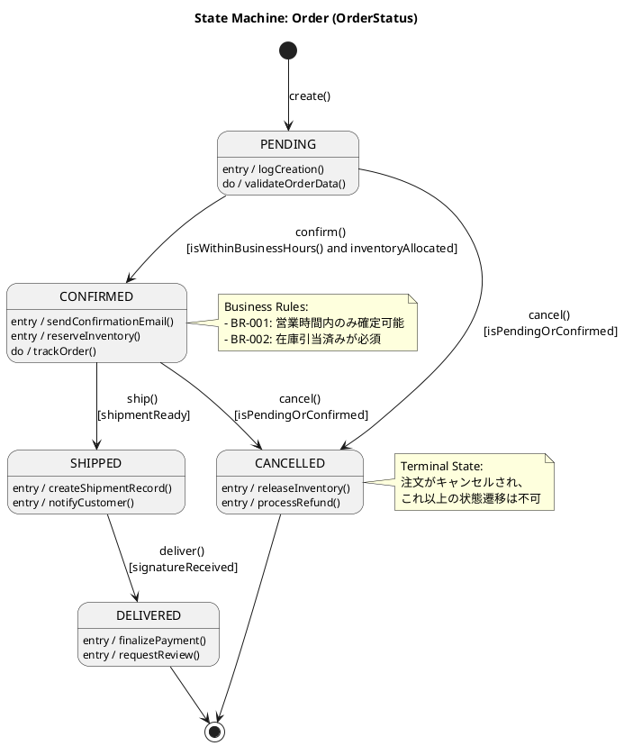
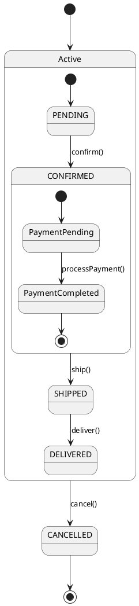

# Class to State Machine Diagram Generator v1

Generate comprehensive UML state machine diagrams for stateful domain entities.

## Overview / 概要

This skill creates state machine diagrams that define the lifecycle and behavior of entities with status/state attributes. These diagrams are critical for:
- Understanding entity lifecycle management
- Implementing state transition logic correctly
- Enforcing business rule compliance
- Validating state changes
- Preventing invalid state transitions
- Code generation with state validation

**Key capabilities:**
- ✅ Identifies stateful entities automatically
- ✅ Generates state machine diagrams from enumerations
- ✅ Extracts transitions from business methods
- ✅ Adds guards from business rules
- ✅ Includes entry/exit actions
- ✅ **MUST generate PlantUML (.puml) files** - MANDATORY OUTPUT
- ✅ Outputs JSON metadata and optional XMI formats
- ✅ **Multi-language state labels (Japanese/English/Bilingual)** ⭐ NEW!
- ✅ **Inherits language from domain model** ⭐ NEW!

---

## Language Support / 言語サポート ⭐

Generates state machine diagrams with language-appropriate state names, transitions, and guards. Inherits settings from domain-model.json.

**Example:** 
- Japanese: `状態 PENDING` → `状態 CONFIRMED` (確定する)
- English: `State PENDING` → `State CONFIRMED` (confirm)
- Bilingual: `状態 PENDING (Pending)` → `確定済 CONFIRMED (Confirmed)` [確定する / confirm]

**Configuration inherited from:** domain-model.json metadata.language

---

## Position in Workflow / ワークフロー内の位置

```
Step 1: scenario-to-activity-v1
  ↓
Step 2: activity-to-usecase-v1
  ↓
Step 3: usecase-to-class-v1
  ↓ Domain model (authoritative)
Step 3.6: class-to-statemachine-v1 ← YOU ARE HERE
  ↓ State machines
Step 4: usecase-to-code-v1 (enhanced with state logic)
```

**Why after class diagram:**
- Requires entity definitions with status attributes
- Needs enumeration values for states
- Uses business methods for transitions
- Relies on business rules for guards

---

## Input / 入力

### Required

**1. Domain model:**
- `{project}_domain-model.json` (from usecase-to-class-v1)
- **CRITICAL**: Must be the formal model with complete metadata

### Optional

**2. Use case specifications:**
- `{project}_usecase-output.json`
- Provides additional context for state transitions

**3. Execution options:**
- `generate_xmi`: Boolean (default: true)
- `include_composite_states`: Boolean (default: false)
- `generate_validation_code`: Boolean (default: true)

---

## Workflow / 処理フロー

### Step 0: Language Configuration ⭐ NEW!

Inherit language settings from domain-model.json for state labels, transitions, and guards.

```python
domain_model = load_json(f'{project}_domain-model.json')
language = domain_model.get("metadata", {}).get("language", "en")

# Configure state machine diagram language
config = {
    "state_names": language,      # ja | en | bilingual
    "transition_labels": language,
    "guard_conditions": language
}
```

---

### Step 1: Identify Stateful Entities

**1a. Scan domain model for status attributes:**

```json
{
  "entities": [
    {
      "name": "Order",
      "attributes": [
        {
          "name": "status",
          "type": "OrderStatus",  ← Enumeration type
          "is_required": true,
          "default_value": "PENDING"
        }
      ]
    }
  ],
  "enumerations": [
    {
      "name": "OrderStatus",
      "values": [
        {"name": "PENDING", "value": 0},
        {"name": "CONFIRMED", "value": 1},
        {"name": "SHIPPED", "value": 2},
        {"name": "DELIVERED", "value": 3},
        {"name": "CANCELLED", "value": 4}
      ]
    }
  ]
}
```

**1b. Identify stateful entities:**

Pattern matching:
- Attribute name contains: "status", "state", "ステータス", "状態"
- Attribute type is an enumeration
- Has multiple enum values (≥ 2)

**1c. Result:**
```
Stateful Entities Found:
- Order (status: OrderStatus)
- Shipment (status: ShipmentStatus)
- Inventory (state: InventoryState)
```

---

### Step 2: Extract States from Enumerations

**2a. For each stateful entity, extract states:**

```json
Entity: Order
Status Attribute: status (OrderStatus)
States:
  - PENDING (initial state: determined by default_value)
  - CONFIRMED
  - SHIPPED
  - DELIVERED (final state: heuristic)
  - CANCELLED (final state: heuristic)
```

**2b. Identify initial and final states:**

**Initial state:**
- From `default_value` attribute
- Or: First value in enumeration
- Or: Value named "INITIAL", "PENDING", "NEW", etc.

**Final states:**
- Values named: "COMPLETED", "FINISHED", "CANCELLED", "CLOSED", "DELIVERED", etc.
- Or: States with no outgoing transitions (determined later)

---

### Step 3: Extract Transitions from Business Methods

**3a. Analyze business methods:**

```json
{
  "name": "Order",
  "business_methods": [
    {
      "name": "confirm",
      "description": "注文を確定する",
      "preconditions": ["status == PENDING"],
      "state_changes": [
        {
          "attribute": "status",
          "new_value": "CONFIRMED"
        }
      ]
    },
    {
      "name": "ship",
      "description": "商品を出荷する",
      "preconditions": ["status == CONFIRMED"],
      "state_changes": [
        {
          "attribute": "status",
          "new_value": "SHIPPED"
        }
      ]
    },
    {
      "name": "cancel",
      "description": "注文をキャンセルする",
      "preconditions": ["status == PENDING or status == CONFIRMED"],
      "state_changes": [
        {
          "attribute": "status",
          "new_value": "CANCELLED"
        }
      ]
    }
  ]
}
```

**3b. Extract transitions:**

```
Transitions for Order:
1. PENDING → CONFIRMED
   Trigger: confirm()
   Guard: [status == PENDING]
   
2. CONFIRMED → SHIPPED
   Trigger: ship()
   Guard: [status == CONFIRMED]
   
3. PENDING → CANCELLED
   Trigger: cancel()
   Guard: [status == PENDING]
   
4. CONFIRMED → CANCELLED
   Trigger: cancel()
   Guard: [status == CONFIRMED]
```

---

### Step 4: Add Guards from Business Rules

**4a. Extract business rules:**

```json
{
  "business_rules": [
    {
      "id": "BR-001",
      "description": "営業時間内のみ受注確定可能",
      "type": "constraint",
      "applies_to": ["Order.confirm"],
      "implementation": "this.orderDate.isWithinBusinessHours(BUSINESS_HOURS)"
    },
    {
      "id": "BR-002",
      "description": "在庫引当済みの場合のみ確定可能",
      "type": "constraint",
      "applies_to": ["Order.confirm"],
      "implementation": "this.inventoryAllocation.status === 'ALLOCATED'"
    }
  ]
}
```

**4b. Add guards to transitions:**

```
Transition: PENDING → CONFIRMED
Trigger: confirm()
Guards:
  - [status == PENDING] (from precondition)
  - [isWithinBusinessHours()] (from BR-001)
  - [inventoryAllocated] (from BR-002)
```

---

### Step 5: Add Entry and Exit Actions

**5a. Infer entry actions:**

Pattern: Methods called when entering a state
- State change → State X: Look for methods that run after transition

**5b. Infer exit actions:**

Pattern: Methods called when leaving a state
- State change from X: Look for cleanup or finalization methods

**Example:**
```
State: CONFIRMED
Entry actions:
  - sendConfirmationEmail()
  - reserveInventory()
  - logStateChange()

Exit actions:
  - releaseTemporaryHold()
```

**5c. Extract from state_changes metadata:**

```json
{
  "name": "confirm",
  "state_changes": [
    {
      "attribute": "status",
      "new_value": "CONFIRMED"
    }
  ],
  "side_effects": [
    {
      "action": "sendConfirmationEmail",
      "timing": "after_transition"
    },
    {
      "action": "reserveInventory",
      "timing": "after_transition"
    }
  ]
}
```

---

### Step 6: Generate PlantUML State Machine Diagrams ⭐ MANDATORY

**CRITICAL REQUIREMENT**: Always generate .puml files for visualization and documentation.

**6a. For each stateful entity, generate diagram:**

**Structure:**


**6b. For complex entities, use composite states:**

If `include_composite_states` is true:



---

### Step 7: Generate Structured JSON Output

**Filename:** `{project}_statemachines.json`

**Schema:**
```json
{
  "metadata": {
    "source": "class-to-statemachine-v1",
    "generated_at": "ISO 8601 timestamp",
    "version": "1.0",
    "input_domain_model": "{project}_domain-model.json"
  },
  "state_machines": [
    {
      "entity": "Order",
      "status_attribute": "status",
      "status_type": "OrderStatus",
      "initial_state": "PENDING",
      "final_states": ["DELIVERED", "CANCELLED"],
      "states": [
        {
          "name": "PENDING",
          "type": "simple",
          "is_initial": true,
          "is_final": false,
          "entry_actions": [
            {
              "action": "logCreation",
              "description": "ログに作成を記録"
            }
          ],
          "do_activities": [
            {
              "action": "validateOrderData",
              "description": "注文データの継続的検証"
            }
          ],
          "exit_actions": []
        },
        {
          "name": "CONFIRMED",
          "type": "simple",
          "is_initial": false,
          "is_final": false,
          "entry_actions": [
            {
              "action": "sendConfirmationEmail",
              "description": "確認メールを送信"
            },
            {
              "action": "reserveInventory",
              "description": "在庫を予約"
            }
          ],
          "do_activities": [
            {
              "action": "trackOrder",
              "description": "注文追跡"
            }
          ],
          "exit_actions": []
        },
        {
          "name": "CANCELLED",
          "type": "simple",
          "is_initial": false,
          "is_final": true,
          "entry_actions": [
            {
              "action": "releaseInventory",
              "description": "在庫を解放"
            },
            {
              "action": "processRefund",
              "description": "返金処理"
            }
          ],
          "do_activities": [],
          "exit_actions": []
        }
      ],
      "transitions": [
        {
          "id": "T1",
          "from_state": "PENDING",
          "to_state": "CONFIRMED",
          "trigger": "confirm",
          "trigger_type": "method_call",
          "guards": [
            {
              "condition": "status == PENDING",
              "source": "precondition"
            },
            {
              "condition": "isWithinBusinessHours()",
              "source": "business_rule",
              "rule_id": "BR-001"
            },
            {
              "condition": "inventoryAllocated",
              "source": "business_rule",
              "rule_id": "BR-002"
            }
          ],
          "actions": [
            {
              "action": "setConfirmedAt",
              "timing": "on_transition"
            }
          ]
        },
        {
          "id": "T2",
          "from_state": "CONFIRMED",
          "to_state": "SHIPPED",
          "trigger": "ship",
          "trigger_type": "method_call",
          "guards": [
            {
              "condition": "status == CONFIRMED",
              "source": "precondition"
            },
            {
              "condition": "shipmentReady",
              "source": "inferred"
            }
          ],
          "actions": []
        },
        {
          "id": "T3",
          "from_state": "PENDING",
          "to_state": "CANCELLED",
          "trigger": "cancel",
          "trigger_type": "method_call",
          "guards": [
            {
              "condition": "status == PENDING or status == CONFIRMED",
              "source": "precondition"
            }
          ],
          "actions": []
        }
      ],
      "business_rules": [
        {
          "id": "BR-001",
          "description": "営業時間内のみ受注確定可能",
          "applies_to_transitions": ["T1"]
        },
        {
          "id": "BR-002",
          "description": "在庫引当済みの場合のみ確定可能",
          "applies_to_transitions": ["T1"]
        }
      ]
    }
  ],
  "validation_summary": {
    "total_state_machines": 3,
    "total_states": 15,
    "total_transitions": 18,
    "entities_with_invalid_transitions": []
  }
}
```

---

### Step 8: Generate State Validation Code

If `generate_validation_code` is true, create validation helper code:

**Filename:** `{project}_state-validators.ts` (or .py, .java)

**TypeScript Example:**
```typescript
// order-state-validator.ts (自動生成)

/**
 * State Machine Validator for Order
 * Auto-generated from domain-model.json
 * Source: class-to-statemachine-v1
 */

export enum OrderStatus {
  PENDING = 'PENDING',
  CONFIRMED = 'CONFIRMED',
  SHIPPED = 'SHIPPED',
  DELIVERED = 'DELIVERED',
  CANCELLED = 'CANCELLED'
}

export class OrderStateMachine {
  
  /**
   * Valid state transitions
   */
  private static readonly VALID_TRANSITIONS: Map<OrderStatus, OrderStatus[]> = new Map([
    [OrderStatus.PENDING, [OrderStatus.CONFIRMED, OrderStatus.CANCELLED]],
    [OrderStatus.CONFIRMED, [OrderStatus.SHIPPED, OrderStatus.CANCELLED]],
    [OrderStatus.SHIPPED, [OrderStatus.DELIVERED]],
    [OrderStatus.DELIVERED, []],
    [OrderStatus.CANCELLED, []]
  ]);
  
  /**
   * Check if a state transition is valid
   */
  static canTransition(from: OrderStatus, to: OrderStatus): boolean {
    const validNextStates = this.VALID_TRANSITIONS.get(from) || [];
    return validNextStates.includes(to);
  }
  
  /**
   * Validate transition: PENDING → CONFIRMED
   * Business Rules: BR-001, BR-002
   */
  static canConfirm(order: Order): { valid: boolean; errors: string[] } {
    const errors: string[] = [];
    
    // Precondition: status == PENDING
    if (order.status !== OrderStatus.PENDING) {
      errors.push('注文は PENDING 状態である必要があります');
    }
    
    // Guard: BR-001 - 営業時間内のみ
    if (!this.isWithinBusinessHours(order.orderDate)) {
      errors.push('営業時間外は注文確定できません');
    }
    
    // Guard: BR-002 - 在庫引当済み
    if (!order.inventoryAllocated) {
      errors.push('在庫が引当されていません');
    }
    
    return {
      valid: errors.length === 0,
      errors
    };
  }
  
  /**
   * Validate transition: CONFIRMED → SHIPPED
   */
  static canShip(order: Order): { valid: boolean; errors: string[] } {
    const errors: string[] = [];
    
    if (order.status !== OrderStatus.CONFIRMED) {
      errors.push('注文は CONFIRMED 状態である必要があります');
    }
    
    if (!order.shipmentReady) {
      errors.push('出荷準備が完了していません');
    }
    
    return {
      valid: errors.length === 0,
      errors
    };
  }
  
  /**
   * Entry action: CONFIRMED state
   */
  static async onEnterConfirmed(order: Order): Promise<void> {
    // Entry action: sendConfirmationEmail
    await this.sendConfirmationEmail(order);
    
    // Entry action: reserveInventory
    await this.reserveInventory(order);
    
    // Log state change
    console.log(`Order ${order.id} entered CONFIRMED state`);
  }
  
  /**
   * Entry action: CANCELLED state
   */
  static async onEnterCancelled(order: Order): Promise<void> {
    // Entry action: releaseInventory
    await this.releaseInventory(order);
    
    // Entry action: processRefund
    await this.processRefund(order);
    
    console.log(`Order ${order.id} entered CANCELLED state`);
  }
  
  /**
   * Helper: Check business hours (BR-001)
   */
  private static isWithinBusinessHours(date: Date): boolean {
    const hour = date.getHours();
    const day = date.getDay();
    
    // Weekdays (Mon-Fri) 9:00-18:00
    return day >= 1 && day <= 5 && hour >= 9 && hour < 18;
  }
  
  // ... other helper methods
}
```

**Usage in application code:**
```typescript
// In Order entity
async confirm(): Promise<void> {
  // Validate transition
  const validation = OrderStateMachine.canConfirm(this);
  if (!validation.valid) {
    throw new BusinessRuleViolation(validation.errors.join(', '));
  }
  
  // Perform transition
  this.status = OrderStatus.CONFIRMED;
  this.confirmedAt = new Date();
  
  // Execute entry actions
  await OrderStateMachine.onEnterConfirmed(this);
  
  // Save
  await this.save();
}
```

---

### Step 9: Generate XMI Model (Optional)

**Filename:** `{project}_statemachine-model.xmi`

UML 2.5.1 State Machine in XMI 2.5.1 format.

**Structure:**
```xml
<?xml version="1.0" encoding="UTF-8"?>
<xmi:XMI xmi:version="2.5.1" 
         xmlns:xmi="http://www.omg.org/spec/XMI/20131001"
         xmlns:uml="http://www.omg.org/spec/UML/20161101">
  
  <uml:Model xmi:type="uml:Model" name="{project}">
    <packagedElement xmi:type="uml:Package" name="StateMachines">
      
      <!-- State Machine for Order -->
      <packagedElement xmi:type="uml:StateMachine" name="Order_StateMachine">
        
        <!-- Regions -->
        <region xmi:type="uml:Region" name="MainRegion">
          
          <!-- Initial Pseudostate -->
          <subvertex xmi:type="uml:Pseudostate" name="Initial" kind="initial"/>
          
          <!-- States -->
          <subvertex xmi:type="uml:State" name="PENDING">
            <entry xmi:type="uml:OpaqueBehavior" name="logCreation"/>
            <doActivity xmi:type="uml:OpaqueBehavior" name="validateOrderData"/>
          </subvertex>
          
          <subvertex xmi:type="uml:State" name="CONFIRMED">
            <entry xmi:type="uml:OpaqueBehavior" name="sendConfirmationEmail"/>
            <entry xmi:type="uml:OpaqueBehavior" name="reserveInventory"/>
          </subvertex>
          
          <subvertex xmi:type="uml:State" name="CANCELLED">
            <entry xmi:type="uml:OpaqueBehavior" name="releaseInventory"/>
            <entry xmi:type="uml:OpaqueBehavior" name="processRefund"/>
          </subvertex>
          
          <subvertex xmi:type="uml:FinalState" name="Final"/>
          
          <!-- Transitions -->
          <transition xmi:type="uml:Transition" 
                      source="Initial" 
                      target="PENDING">
            <effect xmi:type="uml:OpaqueBehavior" name="create"/>
          </transition>
          
          <transition xmi:type="uml:Transition" 
                      source="PENDING" 
                      target="CONFIRMED">
            <trigger xmi:type="uml:Trigger">
              <event xmi:type="uml:CallEvent" name="confirm"/>
            </trigger>
            <guard xmi:type="uml:Constraint">
              <specification xmi:type="uml:OpaqueExpression" 
                            body="isWithinBusinessHours() and inventoryAllocated"/>
            </guard>
          </transition>
          
          <transition xmi:type="uml:Transition" 
                      source="PENDING" 
                      target="CANCELLED">
            <trigger xmi:type="uml:Trigger">
              <event xmi:type="uml:CallEvent" name="cancel"/>
            </trigger>
          </transition>
          
          <transition xmi:type="uml:Transition" 
                      source="CANCELLED" 
                      target="Final"/>
          
        </region>
      </packagedElement>
    </packagedElement>
  </uml:Model>
</xmi:XMI>
```

---

### Step 10: Generate Documentation

**Filename:** `{project}_statemachine-guide.md`

**Contents:**
```markdown
# ステートマシン図ガイド: {Project Name}

## 概要 / Overview

このドキュメントは、{Project Name}のエンティティライフサイクルを定義するステートマシン図を説明します。

---

## Order エンティティ

### 状態一覧

| 状態 | 種別 | 説明 |
|------|------|------|
| PENDING | 初期状態 | 注文作成直後の状態 |
| CONFIRMED | 中間状態 | 注文が確定され、処理中 |
| SHIPPED | 中間状態 | 商品が出荷された |
| DELIVERED | 最終状態 | 商品が配達完了 |
| CANCELLED | 最終状態 | 注文がキャンセルされた |

### 状態遷移

**1. PENDING → CONFIRMED**
- **トリガー**: `confirm()` メソッド呼び出し
- **ガード条件**:
  - 現在の状態が PENDING である
  - 営業時間内である (BR-001)
  - 在庫が引当済みである (BR-002)
- **アクション**:
  - 確認メールを送信
  - 在庫を予約
  - 確定日時を記録

**2. CONFIRMED → SHIPPED**
- **トリガー**: `ship()` メソッド呼び出し
- **ガード条件**:
  - 現在の状態が CONFIRMED である
  - 出荷準備が完了している
- **アクション**:
  - 出荷記録を作成
  - 顧客に通知

**3. PENDING/CONFIRMED → CANCELLED**
- **トリガー**: `cancel()` メソッド呼び出し
- **ガード条件**:
  - 現在の状態が PENDING または CONFIRMED である
- **アクション**:
  - 在庫を解放
  - 返金処理を開始

### エントリーアクション

各状態に入る際に自動実行される処理:

**CONFIRMED 状態:**
- `sendConfirmationEmail()` - 確認メール送信
- `reserveInventory()` - 在庫予約
- `logStateChange()` - 状態変更ログ

**CANCELLED 状態:**
- `releaseInventory()` - 在庫解放
- `processRefund()` - 返金処理

### ビジネスルール

**BR-001: 営業時間制約**
- 注文確定は営業時間内のみ可能
- 営業時間: 平日 9:00-18:00

**BR-002: 在庫引当制約**
- 注文確定には在庫引当が必須
- 在庫引当失敗時は確定不可

---

## 実装ガイド / Implementation Guide

### 状態遷移の実装

**推奨パターン:**
```typescript
async confirm(): Promise<void> {
  // 1. 遷移可能性を検証
  const validation = OrderStateMachine.canConfirm(this);
  if (!validation.valid) {
    throw new BusinessRuleViolation(validation.errors);
  }
  
  // 2. 状態を変更
  this.status = OrderStatus.CONFIRMED;
  this.confirmedAt = new Date();
  
  // 3. エントリーアクションを実行
  await OrderStateMachine.onEnterConfirmed(this);
  
  // 4. 永続化
  await this.save();
  
  // 5. ドメインイベントを発行
  this.addDomainEvent(new OrderConfirmedEvent(this));
}
```

### 不正な状態遷移の防止

**例: SHIPPED → PENDING は不可**
```typescript
// この遷移は定義されていないため、エラーになる
if (!OrderStateMachine.canTransition(OrderStatus.SHIPPED, OrderStatus.PENDING)) {
  throw new InvalidStateTransition(
    `Cannot transition from SHIPPED to PENDING`
  );
}
```

---

*生成日時: {timestamp}*
*生成ツール: class-to-statemachine-v1*
*バージョン: 1.0*
```

---

## Output / 出力

### Generated Files

For each project:

1. **PlantUML State Machine Diagrams** ⭐ **MANDATORY - MUST BE GENERATED**
   - `{Entity}_StateMachine.puml` - **REQUIRED**
   - One .puml file per stateful entity - **ALWAYS CREATE THESE FILES**
   - **CRITICAL**: These PlantUML files are NOT optional. Always generate them.

2. **Structured JSON** (Required)
   - `{project}_statemachines.json`
   - Machine-readable format for code generation

3. **State Validation Code** (Required if enabled)
   - `{project}_state-validators.ts` (or .py, .java)
   - Helper classes for state validation

4. **Documentation** (Required)
   - `{project}_statemachine-guide.md`
   - Human-readable explanation

5. **XMI Model** (Optional)
   - `{project}_statemachine-model.xmi`
   - UML 2.5.1 / XMI 2.5.1 format

---

## State Machine Elements / ステートマシン要素

### States
- **Simple State**: Basic state with entry/exit actions
- **Composite State**: Contains nested states (if enabled)
- **Initial State**: Marked with [*] →
- **Final State**: Marked with → [*]

### Transitions
- **Trigger**: Event that causes transition (usually method call)
- **Guard**: Boolean condition that must be true
- **Effect**: Action executed during transition

### Actions
- **Entry Action**: Executed when entering state
- **Exit Action**: Executed when leaving state
- **Do Activity**: Continuous activity while in state

---

## Best Practices / ベストプラクティス

### For Quality

1. **Every status enum should have a state machine**: Document lifecycle
2. **Define all valid transitions**: Prevent invalid state changes
3. **Add business rule guards**: Enforce constraints
4. **Include entry/exit actions**: Side effects explicit
5. **Document final states**: Clear termination points

### For Implementation

1. **Generate validation code**: Use auto-generated validators
2. **Enforce in entity methods**: Check before state change
3. **Log state transitions**: Audit trail
4. **Publish domain events**: Notify other parts of system
5. **Test all transitions**: Including invalid ones

### For Maintenance

1. **Update diagrams with code**: Keep synchronized
2. **Version control diagrams**: Track changes over time
3. **Review with domain experts**: Validate business logic
4. **Document exceptions**: Special cases and workarounds

---

## Common Patterns / よくあるパターン

### Linear Lifecycle
```
[*] --> NEW --> IN_PROGRESS --> COMPLETED --> [*]
```

### Cancellable Process
```
[*] --> PENDING
PENDING --> ACTIVE
ACTIVE --> COMPLETED --> [*]
PENDING --> CANCELLED --> [*]
ACTIVE --> CANCELLED --> [*]
```

### Approval Workflow
```
[*] --> SUBMITTED
SUBMITTED --> UNDER_REVIEW
UNDER_REVIEW --> APPROVED --> [*]
UNDER_REVIEW --> REJECTED --> [*]
UNDER_REVIEW --> NEEDS_REVISION
NEEDS_REVISION --> SUBMITTED
```

### Payment Processing
```
[*] --> PENDING
PENDING --> PROCESSING
PROCESSING --> COMPLETED --> [*]
PROCESSING --> FAILED
FAILED --> RETRYING
RETRYING --> PROCESSING
RETRYING --> CANCELLED --> [*]
```

---

## Integration with Other Skills / 他スキルとの連携

### Input Dependencies

**Required:**
- `usecase-to-class-v1` → Provides domain model with status enums

**Optional:**
- `activity-to-usecase-v1` → Additional context for transitions

**Enhances:**
- `usecase-to-code-v1` → Generate state validation logic
- `model-validator-v1` → Validate state machine completeness

### Workflow Position

```
scenario-to-activity-v1
  ↓
activity-to-usecase-v1
  ↓
usecase-to-class-v1
  ↓
class-to-statemachine-v1 ← Adds lifecycle view
  ↓
usecase-to-code-v1 (enhanced)
```

---

## Validation Checklist / 確認チェックリスト

Before finalizing state machines:

- [ ] All status enums have state machines
- [ ] Initial state identified correctly
- [ ] Final states identified correctly
- [ ] All transitions have triggers
- [ ] Guards extracted from business rules
- [ ] Entry/exit actions defined
- [ ] PlantUML syntax is valid
- [ ] JSON output is well-formed
- [ ] Validation code generates successfully
- [ ] Documentation is complete

---

## Limitations / 制限事項

**This skill does NOT:**
- ❌ Generate complete method implementations (use usecase-to-code-v1)
- ❌ Handle concurrent state machines (advanced feature)
- ❌ Model hierarchical state machines deeply (limited to 2 levels)
- ❌ Validate business logic correctness (requires human review)

**What it DOES:**
- ✅ Visualize entity lifecycles
- ✅ Define valid state transitions
- ✅ Generate validation helpers
- ✅ Enforce business rule compliance

---

## Version History / バージョン履歴

- **v1.0** (2026-01-30): Initial version
  - Stateful entity identification
  - State machine generation from enums
  - Transition extraction from methods
  - Guard extraction from business rules
  - Validation code generation
  - PlantUML, JSON, XMI outputs
